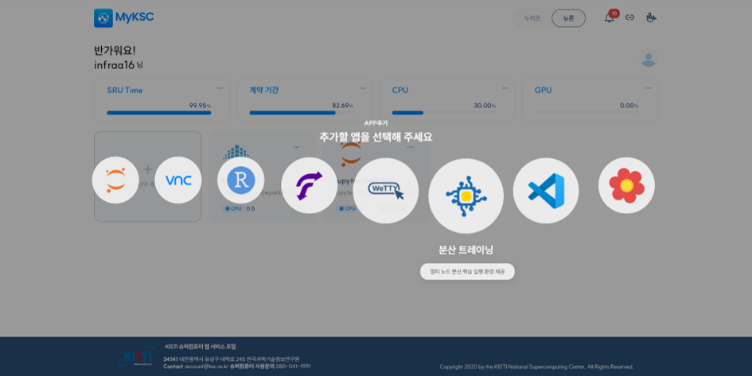
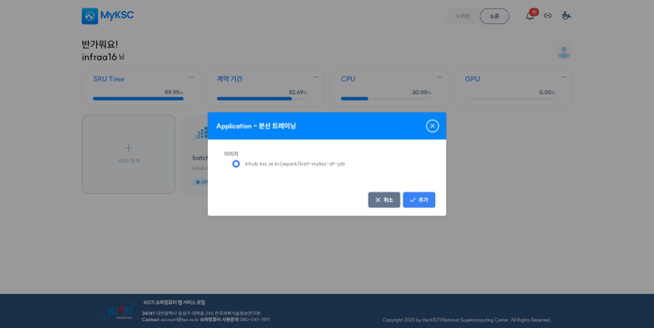
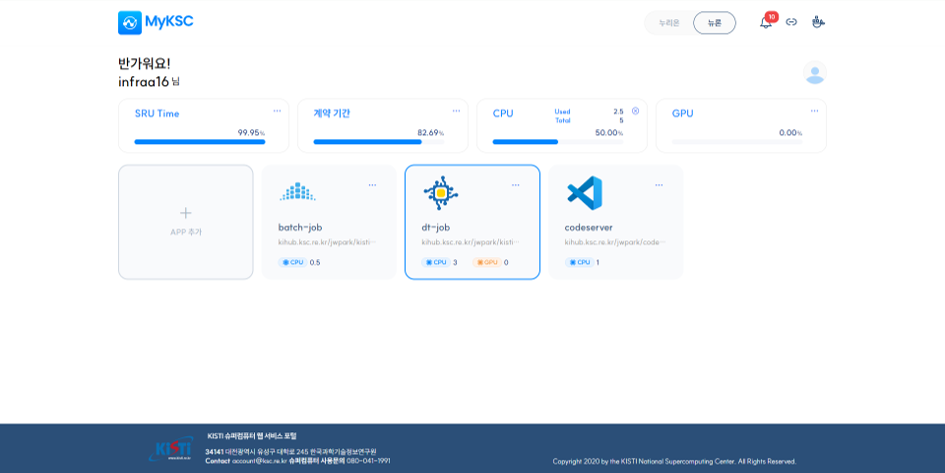
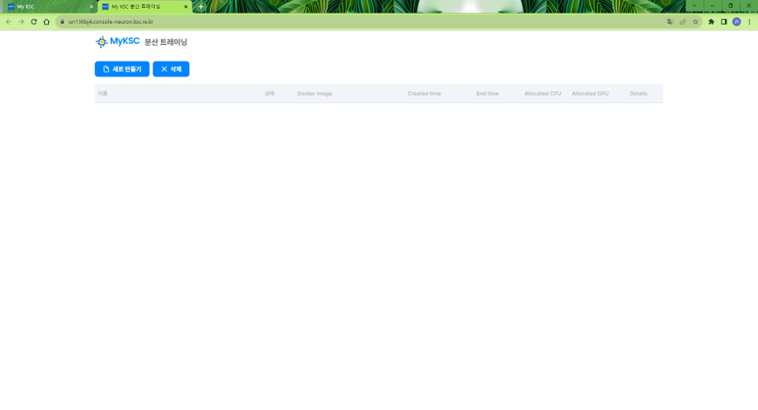
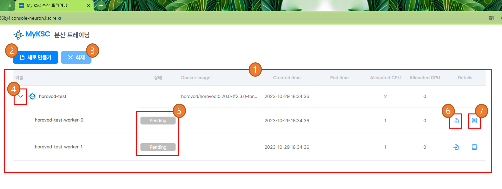
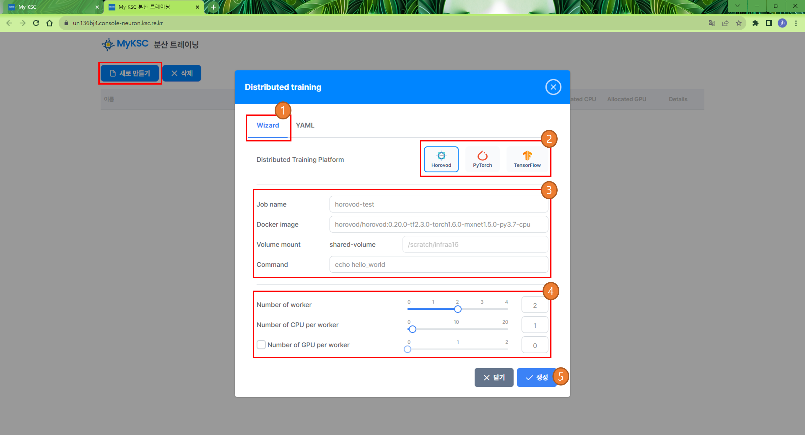
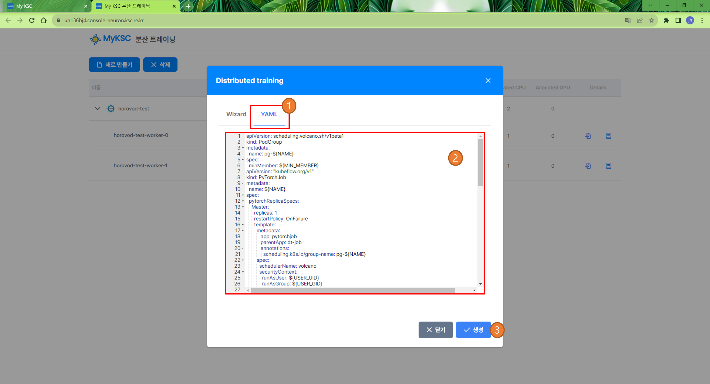
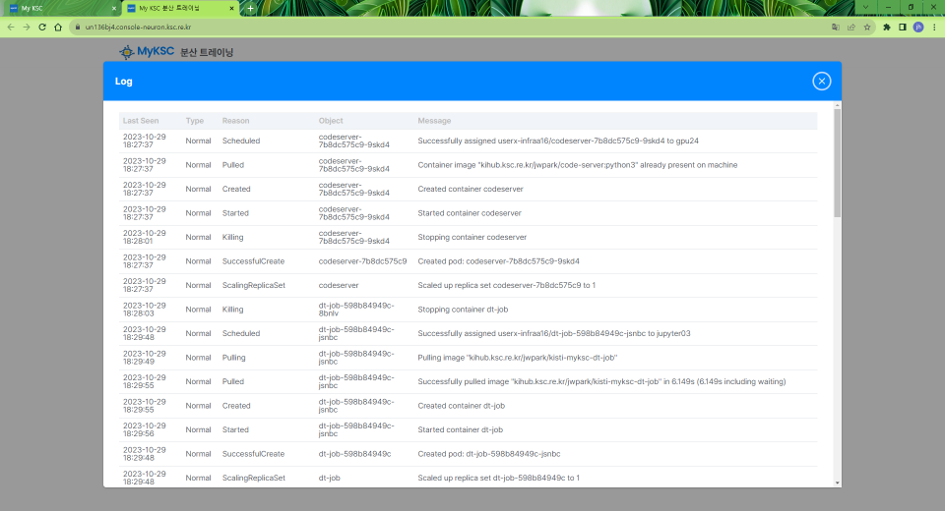
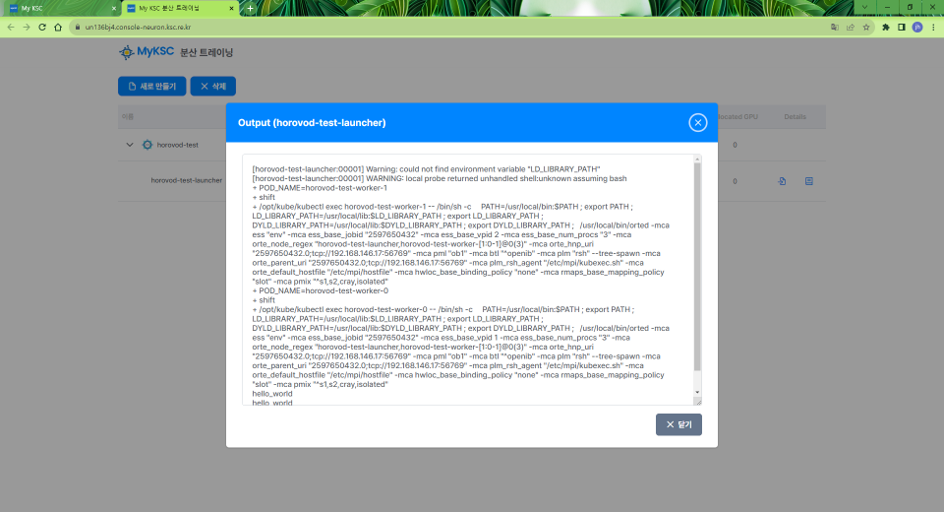

# 분산 트레이닝

#### 1. APP 추가 클릭 후 추가할 앱 선택 화면에서 분산 트레이닝을 선택한다.

<figure><figcaption></figcaption></figure>

#### 2. 이미지를 선택하고 추가 버튼을 클릭한다.

<figure><figcaption></figcaption></figure>

#### 3. APP 추가 후 분산 트레이닝 APP을 클릭하면 브라우저의 새로운 탭에서  분산 트레이닝이 실행된다.

<figure><figcaption></figcaption></figure>

<figure><figcaption></figcaption></figure>

#### 4. 화면 구성은 아래와 같다.

<table><thead><tr><th width="81"> </th><th>설정</th></tr></thead><tbody><tr><td>1</td><td>작업 목록</td></tr><tr><td>2</td><td>작업을 생성하기 위한 화면이 표시된다.</td></tr><tr><td>3</td><td>작업 목록에서 선택한 작업을 삭제한다.</td></tr><tr><td>4</td><td>클릭 시 작업 하위 POD 정보를 표시한다.</td></tr><tr><td>5</td><td>POD 의 상태 정보를 표시한다.</td></tr><tr><td>6</td><td>결과 정보를 표시한다.</td></tr><tr><td>7</td><td>로그 정보를 표시한다.</td></tr></tbody></table>

<figure><figcaption></figcaption></figure>

#### 5. 새로 만들기를 클릭하면 분산 트레이닝 생성을 위한 화면이 표시된다.

1\) Wizard 를 사용한 방법

<table><thead><tr><th width="83"> </th><th>설명</th></tr></thead><tbody><tr><td>1</td><td>Wizard 를 사용하여 생성 시 선택한다.</td></tr><tr><td>2</td><td>분산 트레이닝 플랫폼 을 선택한다. - Horovod(MPIJob), PyTorch(PyTorchJob), TensorFlow(TFJob) 를 지원한다.</td></tr><tr><td>3</td><td>생성 정보를 입력한다.</td></tr><tr><td>4</td><td>사용할 자원 정보를 입력한다.</td></tr><tr><td>5</td><td>작업 생성을 요청 한다.</td></tr></tbody></table>

<figure><figcaption></figcaption></figure>

2\) YAML 를 사용한 방법

<table><thead><tr><th width="81"> </th><th>설명</th></tr></thead><tbody><tr><td>1</td><td>YAML 를 사용하여 생성 시 선택한다.</td></tr><tr><td>2</td><td>YAML 형식으로 생성 정보 및 사용할 자원 정보를 입력한다.</td></tr><tr><td>3</td><td>작업 생성을 요청 한다.</td></tr></tbody></table>

<figure><figcaption></figcaption></figure>

#### 6. 목록에서Log 아이콘을 클릭하면 로그 정보를 표시한다.

<figure><figcaption></figcaption></figure>

#### 7. 목록에서 Output 아이콘을 클릭하면 결과 정보를 표시한다.

1\) 작업이 진행  중인 경우 결과 정보가 표시되지 않을 수 있다.

<figure><figcaption></figcaption></figure>
