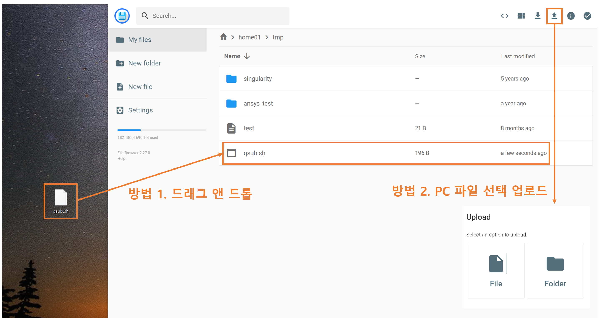

# 데이터 관리(File Browser)

#### 1. APP 추가 클릭 후 추가할 앱 선택 화면에서 데이터 관리를 선택한다.

<figure><figcaption></figcaption></figure>

#### 2. 이미지를 선택하고 추가 버튼을 클릭한다.

<figure><figcaption></figcaption></figure>

#### 3. APP 추가 후 데이터 관리 APP을 클릭하면 브라우저의 새로운 탭에서 File Browser가  실행된다.

<figure><figcaption></figcaption></figure>

<figure><figcaption></figcaption></figure>

#### 4. (파일  업로드) 사용자 PC에서 업로드 할 파일을 드래그하여 데이터 관리 프로그램의 특정 폴더로 이동 시키거나, Upload 아이콘을 클릭하여 PC 파일을 선택  후 업로드 할 수 있다.

<figure><figcaption></figcaption></figure>

#### 5. (파일 다운로드) 슈퍼컴퓨터의  사용자 폴더에서 대상 파일을 선택하고, Download 아이콘을 클릭하여 다운로드 할 수 있다.  여러 개의 파일을 선택하면, 압축 파일로 변환되어 다운로드 된다.&#x20;

<figure><figcaption></figcaption></figure>

