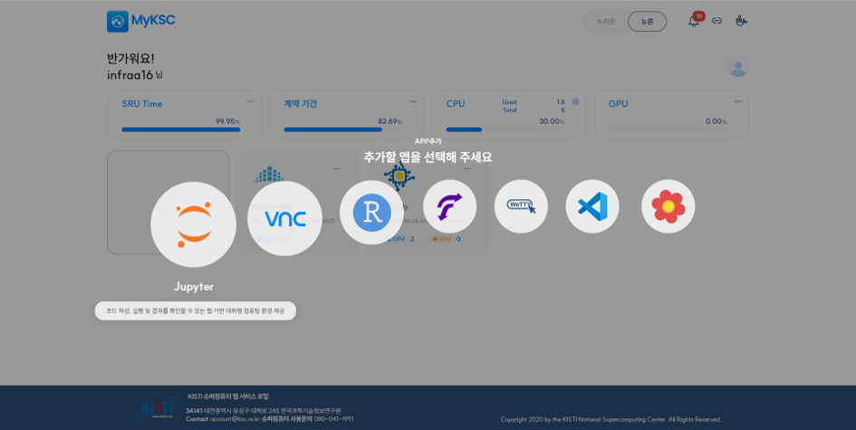
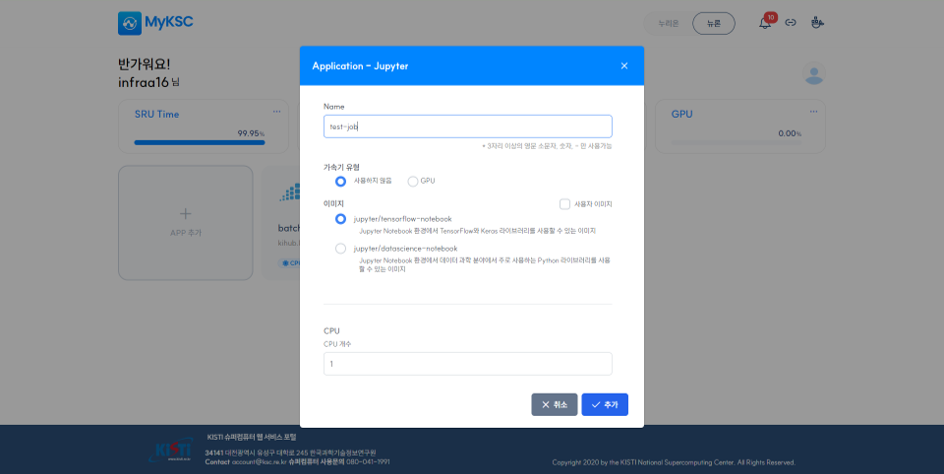
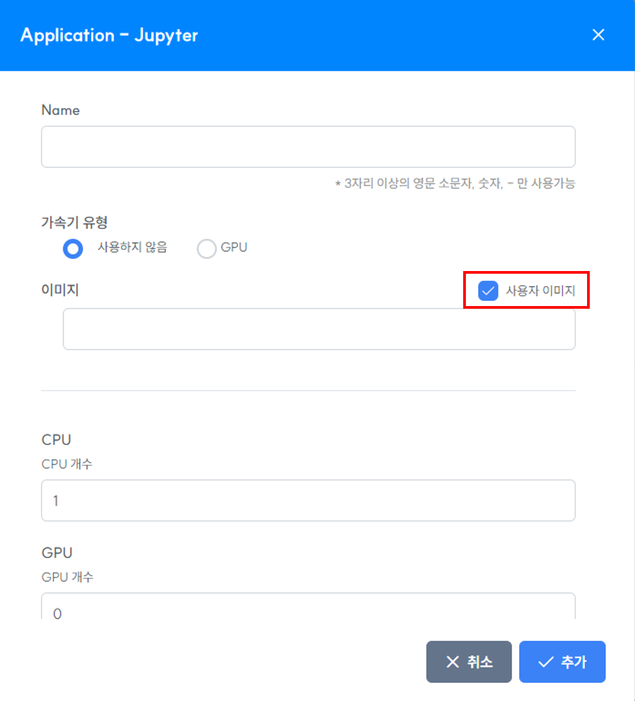
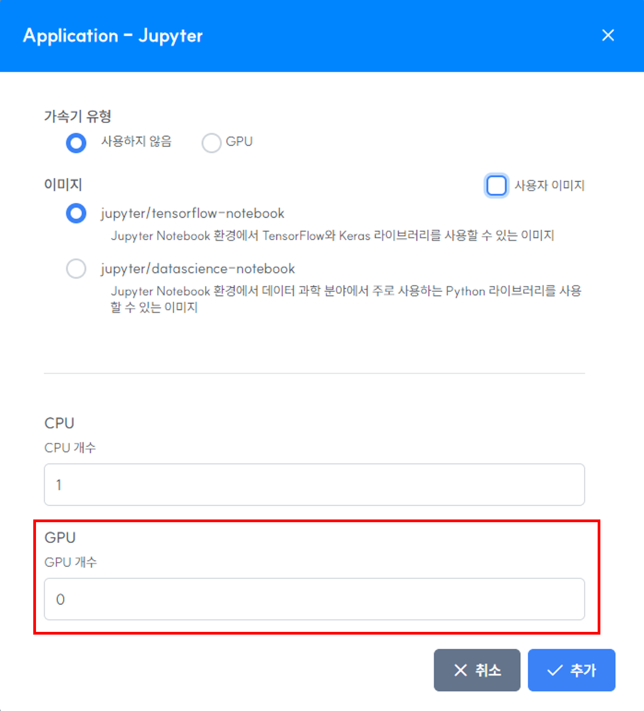
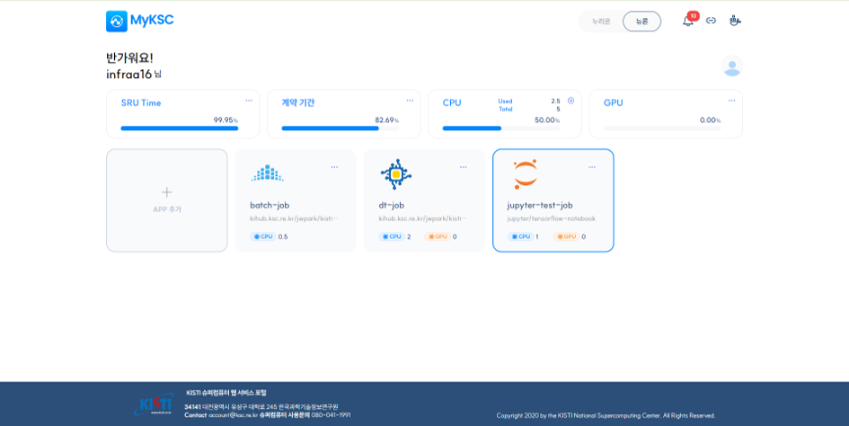
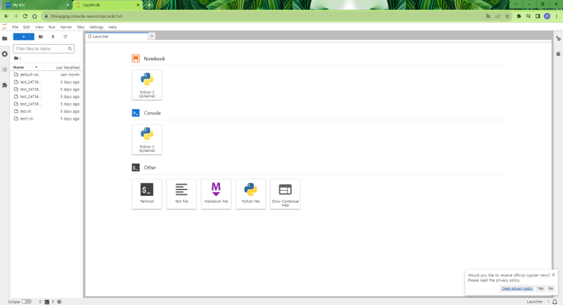

# Jupyter

#### 1. APP 추가 클릭 후 추가할 앱 선택 화면에서 Jupyter을 선택한다.

<figure><figcaption></figcaption></figure>

#### 2. 사용자  작업의 이름을 입력한다.

#### 3. 실행할 Docker 이미지를 list에서 선택하고 추가 버튼을 클릭한다.

<figure><figcaption></figcaption></figure>

#### 4. 제공되는 Docker 이미지 외의 사용자 이미지를 실행할 경우 체크박스를 클릭하고 사용자 이미지 경로를 직접 입력한다.&#x20;

1\) 사용자 지정 이미지 입력 예시 : jupyter/minimal-notebook:latest (도커허브)

<figure><figcaption></figcaption></figure>

#### 5. Neuron 시스템에서는 GPU를 사용할 수 있다.

<figure><figcaption></figcaption></figure>

#### 6. APP 추가 후 Jupyter APP을 클릭하면 브라우저의 새로운 탭에서 Jupyter가 실행된다.

<figure><figcaption></figcaption></figure>

<figure><figcaption></figcaption></figure>
