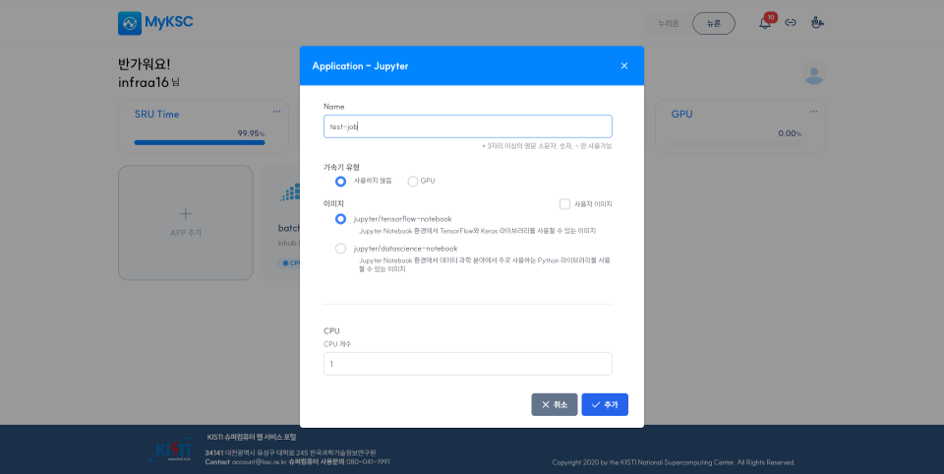
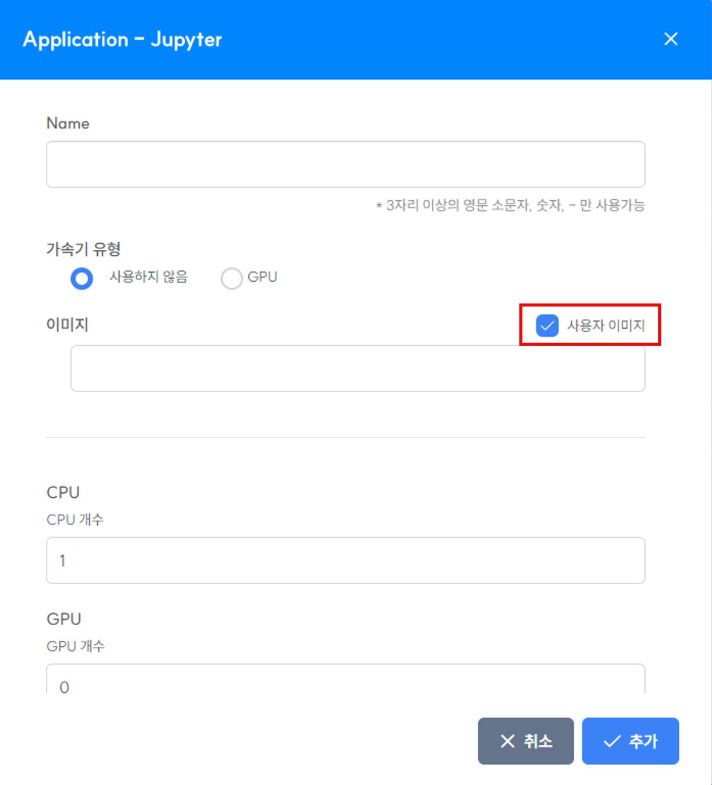
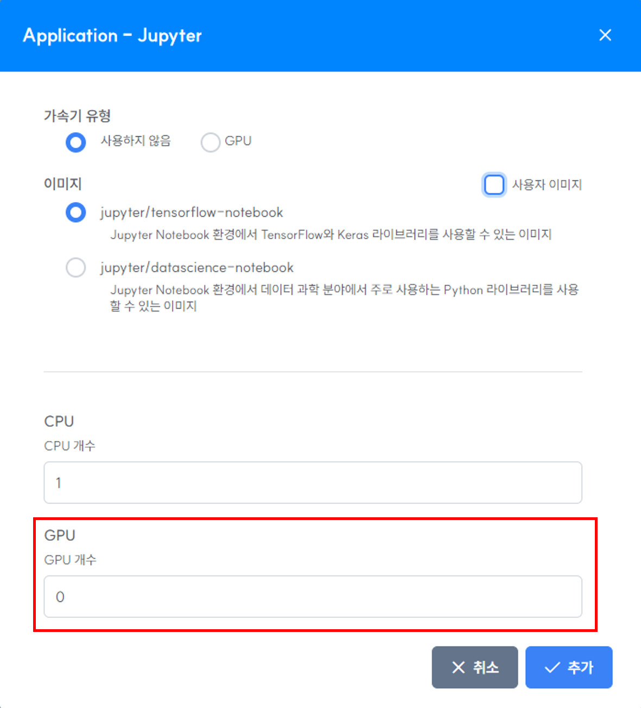
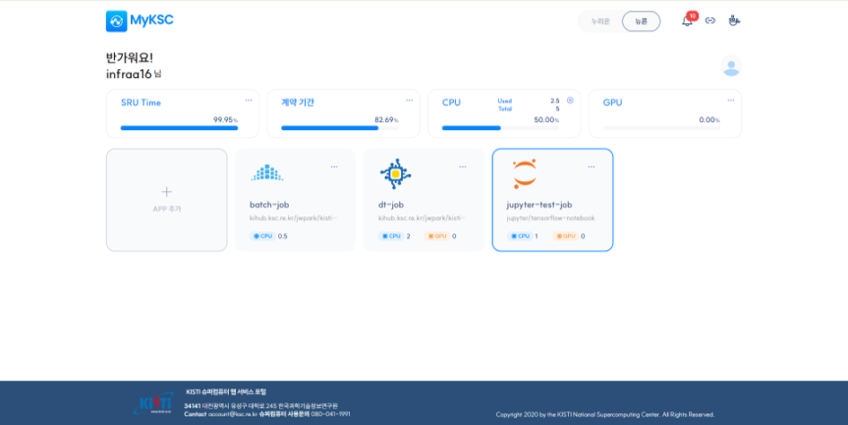
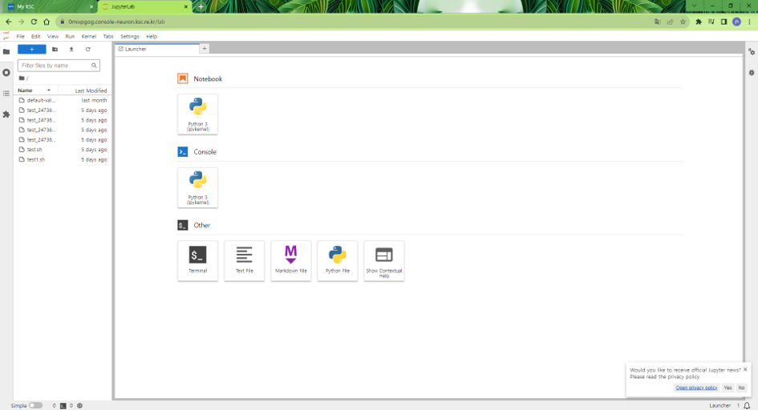
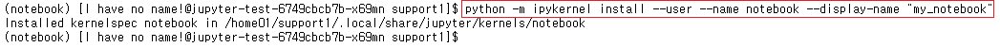
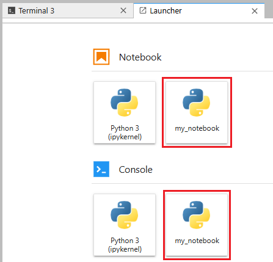

# Jupyter

#### 1. APP 추가 클릭 후 추가할 앱 선택 화면에서 Jupyter을 선택합니다.

<figure><figcaption></figcaption></figure>

#### 2. 사용자  작업의 이름을 입력합니다.

#### 3. 실행할 Docker 이미지를 list에서 선택하고 추가 버튼을 클릭합니다.

<figure><figcaption></figcaption></figure>

#### 4. 제공되는 Docker 이미지 외의 사용자 이미지를 실행할 경우 체크박스를 클릭하고 사용자 이미지 경로를 직접 입력합니다.&#x20;

1\) 사용자 지정 이미지 입력 예시 : jupyter/minimal-notebook:latest (도커허브)

<figure><figcaption></figcaption></figure>

#### 5. Neuron 시스템에서는 GPU를 사용할 수 있습니다.

<figure><figcaption></figcaption></figure>

#### 6. APP 추가 후 Jupyter APP을 클릭하면 브라우저의 새로운 탭에서 Jupyter가 실행됩니다.

<figure><figcaption></figcaption></figure>

<figure><figcaption></figcaption></figure>

#### 7. Jupyter Notebook에 사용자 환경을 커널로 추가하기

사용자 디렉터리에 있는 conda 환경에서 작업을 수행하려면, 아래 예시와 같이 conda 환경에 ipykernel 설치하고, conda 환경을 커널에 등록하면 됩니다.

**1) Jupyter Terminal 실행**

Launcher 화면에서 Other > Terminal 클릭 후 실행

실행화면 :

<figure><figcaption></figcaption></figure>

**2)  conda 환경 적용**

conda env list 명령으로 추가할 conda 환경명을 확인한 뒤 , **conda activate \[conda 환경명]** 명령으로 conda 환경을 적용합니다.

실행화면 :

<figure><figcaption></figcaption></figure>

**3) ipykernel 설치**

**pip install ipykernel** 명령을 실행하여 conda 환경 내 ipykernel 패키지를 설치합니다.&#x20;

실행화면 :

<figure><figcaption></figcaption></figure>

**4) 커널 등록**

**python -m ipykernel install --user --name \[conda 환경명] --display-name "등록할 커널명"** 명령으로 conda 환경을 커널로 등록합니다.&#x20;

예를 들어 conda 환경명이 **notebook** 이고, Jupyter 화면에서 **my\_notebook** 이라는 이름으로 커널을 등록하고 싶다면

```
python -m ipykernel install --user --name notebook --display-name "my_notebook"
```

위 명령을 터미널에 입력하시면 됩니다.

실행화면 :&#x20;

<figure><figcaption></figcaption></figure>

**5) 커널 등록 확인**

등록을 완료한 이후, Jupyter가 실행되고 있는 웹 브라우저를 새로고침 합니다.

새로고침 이후 다시 Laucher를 실행하면 등록된 conda 환경을 확인할 수 있습니다.

실행화면 :&#x20;

<figure><figcaption></figcaption></figure>
