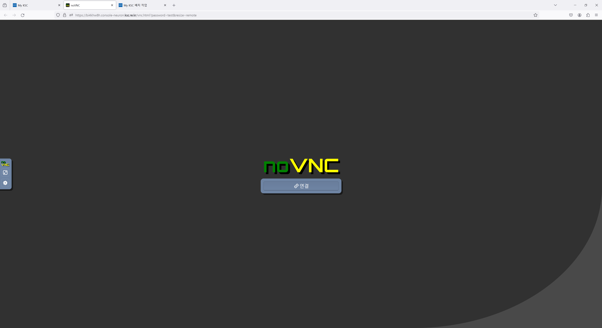

# MATLAB

원격데스크톱(VNC, 우분투 OS) 에서 MATLAB 데스크톱 프로그램을 사용할 수 있으며, 누리온 및 뉴론 시스템의 작업 스케줄러를 통해서 할당된 계산 노드에서 MATLAB Parallel Server를  사용하여 대규모 병렬 연산 작업을 실행할 수 있다. **(MATLAB 지원 버전 :  R2024a)**


누리온 및 뉴론 시스템에서 MATLAB 데스크톱 및 MATLAB Parallel Server를 사용하기 위해서는 사용자(소속기관)가 라이선스를 보유해야 하며, 아래 지침에 따라 [MATLAB 사용자 라이선스 활성화](matlab.md#matlab-1)를 수행해야 한다.

* 보유 라이선스 현황 및 활성화된 컴퓨터를 확인하기 위해서는 [Mathworks 계정](https://kr.mathworks.com/mwaccount)에 접속하시기 바랍니다.  &#x20;
* 사용자 라이선스 관련 문의는 기관 라이선스 담당자 혹은 [MathWorks 계정 및 라이선싱](https://supportcases.mathworks.com/mwsupport/s/casetypeselection?language=ko\&c__caseParameter=AccountandLicensing\&s_tid=srlp_mwa) 에서 요청하시기 바랍니다.



자세한 MATLAB 소프트웨어 사용법은 [MathWorks 도움말  센터](https://kr.mathworks.com/help/)를 참조 하시기 바랍니다. &#x20;

MATLAB 소프트웨어 자체에 대한 기술 지원은 [MathWorks 지원 문의](https://kr.mathworks.com/support/contact_us.html?s_tid=hp_ff_s_support) 에서 요청하시기 바랍니다.


<figure><figcaption><p>matlab-vnc에서 MATLAB 데스크톱 프로그램 실행 화면</p></figcaption></figure>


## 가. MATLAB 데스크톱 프로그램 실행

#### 1. APP 추가 클릭 후 추가할 앱 선택 화면에서 MATLAB via VNC를 선택한다.

<figure><figcaption><p>APP 추가에서 MATLAB via VNC 앱 메뉴 화면</p></figcaption></figure>

#### 2. 사용하고자 하는 CPU(GPU) 수 및  메모리 용량을 선택하고 추가 버튼을 클릭한다. MATLAB 데스크톱 프로그램을 실행하기 위해서는 최소 4GB 이상의 메모리가 필요하다. &#x20;


MyKSC에서 사용자 별 할당 가능한 최대  CPU 코어수  혹은 GPU 수는 아래와 같으나 변경될 수 있다. 사용자 대시보드 상단의 CPU 및 GPU  정보에서 사용자 별 할당량 및 사용량을 확인할 수 있다.&#x20;

&#x20;    (누리온) 5개 CPU 코어

&#x20;    (뉴론) 5개 CPU 코어, 2개 GPU&#x20;

영문 또는 한글을 지원하는 MATLAB 이미지 중에서 선택할 수 있다.


<figure><figcaption><p>(누리온)  MATLAB via VNC 앱 옵션 설정 화면</p></figcaption></figure>

<figure><figcaption><p>(뉴론)  MATLAB via VNC 앱 옵션 설정 화면</p></figcaption></figure>

#### 3. APP 추가 후  대시보드  화면에서  matlab\_vnc APP을 클릭하면 브라우저의 새로운 탭에서 VNC(원격 데스크톱)이 실행되며, 연결 버튼을 클릭하면 VNC 화면이 출력된다.&#x20;

<figure><figcaption><p>(누리온)  실행중인 MATLAB via VNC 앱  목록</p></figcaption></figure>

<figure><figcaption><p>(뉴론)  실행중인MATLAB via VNC 앱  목록</p></figcaption></figure>

<figure><figcaption><p>MATLAB VNC 앱에서  VNC 접속 창</p></figcaption></figure>

#### 4. MATLAB 사용자 라이선스 활성화를 먼저 완료한 후, 바탕 화면에서 MATLAB 아이콘을 클릭하여 MATLAB 데스크톱 프로그램을 실행할 수  있다.

<figure><figcaption><p>MATLAB  데스크톱 프로그램 실행화면-1</p></figcaption></figure>


Academic individual 라이선스를 보유한 MATLAB 사용자는 아래와 같이 터미널에서 명령어를 입력하거나, 바탕화면에서 MATLAB r2024a\_online 아이콘을 클릭하여 MATLAB 데스크톱 프로그램을 실행할 수 있다.

\#> matlab -licmode onlinelicensing


<figure><figcaption><p>(Academic  individual 라이선스) MATLAB  데스크톱 프로그램 실행화면-2</p></figcaption></figure>


#### MATLAB 사용자 라이선스 활성화 방법은 '[나. MATLAB 사용자 라이선스 활성화](matlab.md#matlab-1)' 를 참조하시기 바랍니다.&#x20;


## 나. MATLAB 사용자 라이선스 활성화

MATLAB 데스크톱 및 Parallel Server를 실행하기 위해서는 온라인 라이선스 활성화 또는 사용자 MATLAB 라이선스 서버 연결이 필요하다.

### 1) 온라인 라이선스 활성화

온라인 Mathworks 계정 및  라이선스를 가진 사용자는 아래 절차에 따라 온라인 라이선스 활성화가 가능하다.&#x20;


단, 사용자가 MATALB  VNC 앱을  종료한 후 재시작하는 경우, 사용자 컨테이너에서 호스트 ID가 변경 되기 때문에 온라인 라이선스 활성화 절차를 다시 진행해야 한다.


1. 바탕 화면에서 MATLAB  r2024a 아이콘을 클릭하여 실행된 Mathworks Product Activation 에서 사용자 Email 및 패스워드를 입력한다.&#x20;

<figure><figcaption><p>온라인 MATLAB 라이선스 활성화를 위한 Mathworks 계정 정보 입력 화면</p></figcaption></figure>

2\. 사용자 보유 라이선스 목록에서 적절한 라이선스를 선택한다.&#x20;

<figure><figcaption><p>온라인 MATLAB 라이선스 선택 화면</p></figcaption></figure>

3. 적절한 사용자 라이선스가 선택 되었는지 확인 후 Activate 버튼을 눌러 활성화 한다.

<figure><figcaption><p>온라인 MATLAB 라이선스 활성화를 위한 사용자 정보 확인 화면</p></figcaption></figure>

<figure><figcaption><p>온라인 MATLAB 라이선스 최종  활성화 화면</p></figcaption></figure>

#### (유의사항-1)  MATLAB Academic individual 라이선스 활성화


Academic individual 라이선스를 보유한 MATLAB 사용자는 아래와 같이 터미널에서 명령어를 입력하거나, 바탕화면에서 MATLAB r2024a\_online 아이콘을 클릭하여 라이선스계정 인증을 통해 라이선스 활성화를 진행해야 합니다.&#x20;

\#> matlab -licmode onlinelicensing


<figure><figcaption><p>MATLAB Academic 라이선스 활성화</p></figcaption></figure>

#### (유의사항-2) MATLAB Parallel Server 온라인 라이선스 활성화


MATLAB Parallel Server의 온라인 라이선스를 활성화 하기 위해서는 아래 절차를 따라야 한다.  &#x20;

1\) [Mathworks 라이선스 센터](https://kr.mathworks.com/mwaccount)에 접속하여 보유한 MATLAB Parallel Server 라이선스를 설치 및 활성화에서 온라인 라이선싱으로 변경한다. (단, Academic 라이선스를 보유한 사용자는 변경이 필요하지 않을 수도 있음)

2\) MATLAB 데스크톱 프로그램 실행 후 Cluster Profile Manager의 누리온 및 뉴론 프로파일에서 관련 파라미터를 설정해야 한다.

([누리온](matlab.md#a) / [뉴론](matlab.md#b) 프로파일 파라미터) RequiresOnlineLicensing : true

상기  파라미터를 설정하고 MATLAB Parallel Server 를 통해 병렬 작업을 처음 실행 할 때 아래와 같이 로그인 창이 뜨면  MathWorks 계정 정보를 입력해 MATLAB Parallel Server 라이선스를 활성화 하면 된다.    &#x20;


<figure><figcaption><p>(Mathworks 라이선스  센터) MATLAB Parallel Server 라이선스를  온라인 라이선싱으로  변경-1  </p></figcaption></figure>

<figure><figcaption><p>(Mathworks 라이선스  센터) MATLAB Parallel Server 라이선스를  온라인 라이선싱으로  변경-2</p></figcaption></figure>

<figure><figcaption><p>(MATLAB 데스크톱) MATLAB Parallel Server 라이선스 활성화를 위한 로그인 화면</p></figcaption></figure>


동일  라이선스에서  정해진  횟수 이상 활성화된 컴퓨터가 등록된 경우, [MathWorks 계정](https://kr.mathworks.com/mwaccount)의 라이선스 센터에서 활성화된 컴퓨터를 비활성화해야 한다.&#x20;


<figure><figcaption><p>온라인 라이선스 활성화  횟수 초과 에러 화면</p></figcaption></figure>

<figure><figcaption><p>MathWorks 계정의 라이선스 센터에서 활성화된 컴퓨터를 비활성화 하는 화면</p></figcaption></figure>


온라인 라이선스 활성화 후에 라이선스 정보는 사용자 홈 디렉터리에 저장되며, MATLAB VNC 앱을 재시작하면 자동 삭제된다.&#x20;

\#>  cd \~/.matlab/R2024a\_licenses

\#> ls&#x20;

license\_matlab-vnc-9bcbc7df6-gdwm1\_41235817\_R2024a.lic



온라인 라이선스 및 프로그램 실행 관련 문제가 지속되는 경우 MATLAB 라이선스 및 Mathworks 계정 연결 정보 등을 포함한 사용자 환경 설정을 모두 초기화 해 볼 수 있다.

&#x20;단, 사용자 맞춤 설정 및 최근 기록들이 모두 삭제 될 수 있다.&#x20;

\#> cd \~&#x20;

\#> rm -rf .matlab .MathWorks .MATLABConnector&#x20;


### 2) 사용자 라이선스 서버 연결

사용자(기관)가 구축한 외부 MATLAB 라이선스 서버를 연결하는 라이선스 활성화 방법은 아래와 같이 라이선스 서버를 명기한 network.lic 파일을 생성하여 사용자 홈 디렉터리의 지정된 디렉터리에 저장해야 한다.&#x20;

사용자가 MATALB  VNC 앱을  종료한 후 재시작하는 경우에도 라이선스 활성화 작업을 반복할 필요가 없다.


외부 MATLAB 라이선스 서버와 연결을 허용하기 위해서는 KSC 홈페이지의 [사용자 기술지원(상담) 게시판](https://www.ksc.re.kr/gsjw/gsjw/qna)을 통해 담당자에게 라이선스 서버 IP 및 포트 번호를 기술하여 접속 허용을 요청해야 한다.



MATLAB Parallel Server를 사용하여 누리온 및 뉴론 시스템에서 병렬 연산을 실행하기 위해서는 반드시 해당 라이선스를 제공하는 사용자(소속기관) MATLAB 라이선스 서버 연결이 필요하다.



사용자가 직접 MATLAB 라이선스 서버를 구성하기 위해서는  Mathworks 홈페이지의 [네트워크 라이선스 관리](https://kr.mathworks.com/help/install/administer-network-licenses.html)를 참고하거나 [MathWorks 사를 통해 기술지원](https://kr.mathworks.com/support/contact_us.html?s_tid=hp_ff_s_support)을 요청할 수 있다.&#x20;



```
SERVER 192.168.100.101 50604GT654FG 27000
USE_SERVER
```



```
## 사용자 홈 디렉터리에 .matlab/R2024a 디렉터리를 생성한 후 라이선스 파일을 복사해야 함
#> mkdir -p ~/.matlab/R2024a_licenses 
#> cp ~/network.lic ~/.matlab/R2024a_licenses
```



## 다. MATLAB 병렬 컴퓨팅

### 1) 로컬 서버에서 MATLAB 병렬 연산 작업 실행

MATLAB Parallel Computing Toolbox 라이선스를 보유한 사용자는 MATLAB 데스크톱  프로그램이 실행되고 있는 누리온/뉴론  MyKSC의 로컬 서버에서 MATLAB 병렬 연산을 실행할 수 있다. 아래 예시는 뉴론 MyKSC에서 MATLAB 병렬 연산 실행 예시이며, 누리온 MyKSC에서도 동일한  방식으로 실행할 수 있다.

1. MATLAB 데스크톱 프로그램의 Parallel computing options에서  Create and Manage Clusters...  메뉴의 Discover Clusters를  실행하여 뉴론 시스템을 위한MATLAB Parallel Server cluster로 'Neuron'을 선택하여 프로파일을 추가한다.&#x20;

<figure><figcaption><p>(뉴론) MATLAB Parallel Server cluster 찾기 화면-1</p></figcaption></figure>

<figure><figcaption><p>(뉴론) MATLAB Parallel Server cluster 찾기 화면-2</p></figcaption></figure>

2. Cluster Profile Manager를 실행한다.

<figure><figcaption><p>(뉴론)  Cluster Profile Manager 화면</p></figcaption></figure>

2. 메뉴를 선택하여  Cluster Profile Manager를 실행하고 Cluster Profile에서 Processes를 선택하고 Set as Default 설정 후 Edit 버튼을 눌러서 MATLAB\_VNC 앱에 할당된  CPU 코어 수 이내에서 Numworkers 값을 설정한다.

<figure><figcaption><p>(뉴론)  Cluster Profile(Processes) 옵션 설정 화면</p></figcaption></figure>

3. Command Window에서  사용자의 MATLAB 병렬  프로그램이 저장된 디렉터리로 이동하여  실행 명령어를 입력한다. 아래 예시에서는 MATLAB 데스크톱 프로그램이 실행되고 있는 로컬 서버에서 MALTAB 병렬 연산을 수행하는 방법을 보여주고 있다.&#x20;

#### (뉴론 CPU 기반의  대화식 병렬 연산 작업실행 예시)


(뉴론)  로컬 노드 1대, 3 CPU 코어

* Numworkers : 3&#x20;



```
primeNumbers = primes(unit64(2^18));
compositeNumbers = primeNumbers.*primeNumbers(randperm(numel(primeNumbers)));
factors = zeros(numel(primeNumbers),2);
numWorkers = [1 2 3];
tLocal = zeros(size(numWorkers));

for w = 1:numel(numWorkers)
    tic;
    parfor (idx = 1:numel(compositeNumbers), numWorkers(w))
          factors(idx,:) = factor(compositeNumbers(idx));
    end
    tLocal(w) = toc;
end

f = figure;
plot(numWorkers, tLocal);
title('Run time with the number of workers');
xlabel('Number of workers);
xticks(numWorkers);
ylabel('Run time(sec)');
```



```
pool = parpool('Processes', 3); 
parallel_plot;
delete(pool);
```


<figure><figcaption><p>(뉴론)  로컬 서버에서  CPU 기반 MATLAB 병렬 프로그램 실행 화면</p></figcaption></figure>

#### (뉴론 GPU 기반의  대화식 병렬 연산 작업 실행 예시)


(뉴론)  로컬 노드 1대, 2 CPU 코어, 2 GPU &#x20;

* Numworkers : 2 &#x20;



```
N=1000;
numIterations = 1000;
r = gpuArray.linspace(0,4,N);
x = rand(1,N,"gpuArray");
numGPUs = gpuDeviceCount("available");
parpool("Processes",numGPUs);
numSimulations = 100;
X = zeros(numSimulations,N,"gpuArray");
parfor i = 1:numSimulations
    X(i,:) = rand(1,N,"gpuArray");
    for n=1:numIterations
        X(i,:) = r.*X(i,:).*(1-X(i,:));
    end
end
figure
plot(r,X,'.');
```


```
numGPUS = gpuDeviceCount("available");
pool = ("Processes",numGPUS);
multi_gpu;
delete(pool);
```

<figure><figcaption><p>(뉴론)  로컬 서버에서  GPU 기반 MATLAB 병렬 프로그램 실행 화면</p></figcaption></figure>

### 2) 누리온/뉴론 계산 노드에서  MATLAB 병렬 연산 작업 실행

MATLAB Parallel Server 라이선스를 보유한 사용자는 누리온/뉴론 시스템의 계산 노드에서 MATLAB 병렬 연산 작업을 실행할 수 있다.


MATLAB Parallel Server를 통한 병렬 컴퓨팅 연산을 실행하기 위해서는 온라인 라이선스 활성화 또는 사용자 라이선스 서버  연결이 필요하며 사용자 [MATLAB 사용자 라이선스 활성화](matlab.md#matlab-1)를 참고 하시기 바랍니다.   &#x20;


<figure><figcaption><p>누리온/뉴론 시스템에서  MATLAB parallel server를 통한 병렬 연산 실행 개요</p></figcaption></figure>

### &#x20;   a. 누리온&#x20;

1. MATLAB 데스크톱 프로그램의 Parallel computing options에서  Create and Manage Clusters...  메뉴의 Discover Clusters를  실행하여  누리온 시스템을 위한MATLAB Parallel Server cluster로 'Nurion'을 선택하여 프로파일을 추가한다.

<figure><figcaption><p>(누리온) MATLAB Parallel Server cluster 찾기 화면-1</p></figcaption></figure>

<figure><figcaption><p>(누리온) MATLAB Parallel Server cluster 찾기 화면-2</p></figcaption></figure>

2. Cluster Profile 목록에서 Nurion을 선택하고 Set as Default 설정 후 Edit 버튼을 눌러서 아래와 같은 파라미터의 값을 설정한다.

<figure><figcaption><p>(누리온) Cluster Profile Manager 실행 화면</p></figcaption></figure>

* Numworkers :  병렬 연산을 실행할 워커수를 지정한다. 누리온 시스템에서  matlab 병렬 연산을 위한  계산 노드는 노드 당 40개의 CPU 코어를 가지고 있다.  사용자의 MATLAB Parallel server 라이선스 수 이내에서 워커수를 짝수로  설정한다.&#x20;
* JobStorageLocation :  사용자의 스크래치 디렉터리에서  작업 정보가 저장될 경로를 지정한다.&#x20;
* RequiresOnlineLicensing : Matlab Parallel Server 온라인 라이선스 활성화를 위해서는 true로 설정한다.\
  \* MATLAB Parallel Server 라이선스도 온라인 라이선싱으로 변경 되어야 한다. ([관련 링크](matlab.md#matlab-parallel-server))&#x20;
* EmailAddress :  작업 시작  및 종료 시 안내 메일을 받을 사용자 메일 주소를 지정한다.
* QueueName:  누리온 시스템에서 MATLAB 병렬 연산을  위해 사용할 배치 작업 스케줄러(PBS Pro) 작업큐의 이름을 지정한다.  현재 norm\_skl 큐만 사용  가능하다.&#x20;


누리온 시스템의 배치  작업 스케줄러(PBS pro)에서 지원하는 큐(norm\_skl)의 계산 노드 정보 등은 [스케줄러를 통한 작업실행(PBS)](broken-reference) 또는 [MyKSC 배치작업 APP](pbs-slurm.md)의 큐 정보를 참조하시기 바랍니다.&#x20;


<figure><figcaption><p>(누리온) Cluster Profile Manager에서 파라미터 설정하기-1</p></figcaption></figure>

<figure><figcaption><p>(누리온) Cluster Profile Manager에서 파라미터 설정하기-2</p></figcaption></figure>

3. Command Window에서  사용자의MATLAB 병렬  프로그램이 저장된 디렉터리로 이동하여  실행 명령어를 입력한다. 아래 예제는 누리온 계산 노드의 MATLAB 워커에서 대화식  병렬 작업 및 일괄 처리식 병렬 작업을 실행하는 방법을 보여주고 있다.

#### (대화식 병렬 연산 작업실행 예시)


(누리온) 리모트 계산 노드 1대, 32 CPU 코어/노드

* Numworkers : 32  &#x20;
* QueueName : norm\_skl&#x20;



```
primeNumbers = primes(unit64(2^19));
compositeNumbers = primeNumbers.*primeNumbers(randperm(numel(primeNumbers)));
factors = zeros(numel(primeNumbers),2);
numWorkers = [1 2 4 8 16 32];
tLocal = zeros(size(numWorkers));

for w = 1:numel(numWorkers)
    tic;
    parfor (idx = 1:numel(compositeNumbers), numWorkers(w))
          factors(idx,:) = factor(compositeNumbers(idx));
    end
    tLocal(w) = toc;
end

f = figure;
plot(numWorkers, tLocal);
title('Run time with the number of workers');
xlabel('Number of workers);
xticks(numWorkers);
ylabel('Run time(sec)');
```


```
pool = parpool('Nurion', 32);
parallel_plot;
delete(pool);
```


좀 더 자세한 **parpool** 함수 사용법은 [MATLAB 도움말](https://kr.mathworks.com/help/parallel-computing/parpool.html?s_tid=srchtitle_site_search_1_parpool)을 참조하시기 바랍니다.&#x20;


<figure><figcaption><p>(누리온) 대화식 병렬 작업 실행 예시</p></figcaption></figure>

#### (일괄 처리식 병렬 연산 작업 실행 예시)


(누리온)  리모트 계산 노드 1대, 32 CPU 코어/노드

* Numworkers : 32  &#x20;
* QueueName : norm\_skl&#x20;



```
function [numWorkers,tLocal] = parallelFcn()
  compositeNumbers = primeNumbers.*primeNumbers(randperm(numel(primeNumbers)));
  factors = zeros(numel(primeNumbers),2);
  numWorkers = [1 2 4 8 16 31];
  tLocal = zeros(size(numWorkers));
  for w = 1:numel(numWorkers)
    tic;
    parfor (idx = 1:numel(compositeNumbers), numWorkers(w))
          factors(idx,:) = factor(compositeNumbers(idx));
    end
    tLocal(w) = toc;
  end
end  
```



```
totalNumberOfWorkers = 32;
cluster = parcluster("Nurion");
job = batch(cluster,'parallelFcn',2,{},'Pool', totalNumberOfWorkers-1,'CurrentFolder','.');
results=fetchOutputs(job);
numWorkers=results{1};
tLocal=results{2};
disp(numWorkers);
disp(tLocal);
```



batch  함수에서 병렬 풀은 병렬 연산작업 관리를 위해 사용자가 필요로 하는 워커수(CPU 코어수) 보다 한 개 더 요구된다. 예시와 같이 31개의 워커(CPU 코어)를  필요로 하는 병렬 작업은 32개의 워커(CPU 코어)가 필요하다. &#x20;

좀 더 자세한 batch 함수 사용법은 [MATLAB 도움말](https://kr.mathworks.com/help/parallel-computing/batch.html?searchHighlight=batch\&s_tid=srchtitle_support_results_1_batch)을 참조하시기 바랍니다.&#x20;



MATLAB 병렬 연산작업은 누리온 시스템의 배치 작업 스케줄러(PBS Pro)를 통해 할당된 계산 노드에서 실행되며, MyKSC의 배치작업 App을 실행하여 제출된 사용자 작업 및 큐 정보 등을 확인할 수 있다.


<figure><figcaption><p>(누리온) MyKSC 배치 작업 App 실행 화면</p></figcaption></figure>

### &#x20;   b. 뉴론

1. MATLAB 데스크톱 프로그램의 Parallel computing options에서  Create and Manage Clusters...  메뉴의 Discover Clusters를 실행하여 뉴론 시스템을 위한 MATLAB Parallel Server cluster로 **Neuron**을 선택하여 프로파일을 추가한다.&#x20;

<figure><figcaption><p>(뉴론) MATLAB Parallel Server cluster 찾기 화면-1</p></figcaption></figure>

<figure><figcaption><p>(뉴론) MATLAB Parallel Server cluster 찾기 화면-2</p></figcaption></figure>

2. Cluster Profile 목록에서  **Neuron**을 선택하고 Set as Default 설정 후 Edit 버튼을 눌러서 아래와 같은 파라미터의 값을 설정한다.

<figure><figcaption><p>(뉴론) Cluster Profile Manager 실행 화면</p></figcaption></figure>

* Numworkers :  병렬 연산을 실행할 워커수를 지정한다. 뉴론 시스템에서  matlab 병렬 연산을 위한  계산 노드는  다양한 구성을 가지고 있다.  사용자의 MATLAB Parallel server 라이선스 수 이내에서 워커수를 설정한다.
* JobStorageLocation :  사용자의 스크래치 디렉터리에서  작업 정보가 저장될 경로를 지정한다.&#x20;
* RequiresOnlineLicensing : Matlab Parallel Server 온라인 라이선스 활성화를 위해서는 true로 설정한다.      \* MATLAB Parallel Server 라이선스도 온라인 라이선싱으로 변경 되어야 한다. ([관련 링크](matlab.md#matlab-parallel-server))&#x20;
* EmailAddress :  작업 종료 시 안내 메일을 보낼 사용자 메일 주소를 지정한다.
* GPU: 계산  노드 당 GPU 수를 지정한다.
* MemPerCPU : CPU 코어 당 메모리 용량을 지정한다.&#x20;
* Nodes : 계산 노드 수를 지정한다.&#x20;
* Partition: 파티션(큐)를 지정한다. &#x20;
* TaskPerNode: 계산 노드 당 타스크 수를 지정한다. &#x20;


뉴론 시스템의 배치  작업 스케줄러(SLURM)에서 지원하는 Partition(큐) 리스트 및 Partition(큐) 별 계산 노드 정보 등은 [스케줄러를 통한 작업실행(SLURM)](broken-reference) 또는 [KSC 배치작업 APP](pbs-slurm.md)의 큐 정보를 참조하시기 바랍니다.&#x20;


<figure><figcaption><p>(뉴론) Cluster Profile Manager에서 파라미터 설정하기-1</p></figcaption></figure>

<figure><figcaption><p>(뉴론) Cluster Profile Manager에서 파라미터 설정하기-2</p></figcaption></figure>

#### ( CPU 기반의  일괄 처리식 병렬 연산 작업 실행 예시)


(뉴론) 리모트 계산 노드 2대, 16 CPU 코어/노드

* Numworkers : 32 &#x20;
* GPU : 0
* MemPerCPU : 4gb
* Nodes : 2
* Partition : skl
* TasksPerNode : 16



```
function [numWorkers,tLocal] = parallelFcn()
  primeNumbers = primes(unit64(2^18)); 
  compositeNumbers = primeNumbers.*primeNumbers(randperm(numel(primeNumbers)));
  factors = zeros(numel(primeNumbers),2);
  numWorkers = [1 2 4 8 16 31];
  tLocal = zeros(size(numWorkers));
  
  for w = 1:numel(numWorkers)
    tic;
    parfor (idx = 1:numel(compositeNumbers), numWorkers(w))
          factors(idx,:) = factor(compositeNumbers(idx));
    end
    tLocal(w) = toc;
  end
  
end  
```



```
totalNumberOfWorkers = 32;
cluster = parcluster("Neuron");
job = batch(cluster,'parallelFcn',2,{},'Pool', totalNumberOfWorkers-1,'CurrentFolder','.');
results=fetchOutputs(job);
numWorkers=results{1};
tLocal=results{2};
disp(numWorkers);
disp(tLocal);
```



batch  함수에서 병렬 풀은 병렬 작업 관리를 위해 사용자가 필요로 하는 워커수(CPU 코어수) 보다 한 개 더 요구된다. 예시와 같이 31개의 워커(CPU 코어)를 사용하는 병렬 작업은 32개의 워커(CPU 코어)가 필요하다. &#x20;

좀 더 자세한 batch 함수 사용법은 [MATLAB 도움말](https://kr.mathworks.com/help/parallel-computing/batch.html?searchHighlight=batch\&s_tid=srchtitle_support_results_1_batch)을 참조하시기 바랍니다.&#x20;



MATLAB 병렬 작업은 누리온 시스템의 배치 작업 스케줄러(Slurm)를 통해 할당된 계산 노드에서 실행되며, [MyKSC의 배치작업 App](pbs-slurm.md)을 실행하여 제출된 사용자 작업 및 큐 정보 등을 확인할 수 있다.


<figure><figcaption><p>(뉴론) MyKSC 배치 작업 App에서 큐 정보 화면</p></figcaption></figure>

#### ( GPU 기반의 대화식 병렬 연산 작업 실행 예시)


(뉴론) 리모트 계산 노드 2대, 2 CPU 코어/노드, 2 GPU/노드

* Numworkers : 4 &#x20;
* GPU : 2
* MemPerCPU : 4gb
* Nodes : 2
* Partition : cas\_v100nv\_4
* TasksPerNode : 2



```
N = 10000; 
numIterations = 10000; 
numSimulations = 1000; 
r = linspace(0, 4, N); 
spmd
    gpuID = gpuDevice;
    fprintf("GPU %d is using...\n", gpuID.Index);
    r_gpu = gpuArray(r);
    X = rand(numSimulations, N, 'gpuArray');
    for n = 1:numIterations
        X = r_gpu .* X .* (1 - X);
    end
    X = gather(X);
end
X_final = cat(1, X{:});
figure
plot(r, X_final, '.');
title('Multi-GPU Logistic Map Simulation');
xlabel('r');
ylabel('X');
```


```
pool = parpool('Neuron', 4);
multi_node_gpu;
delete(pool);
```

<figure><figcaption><p>(뉴론) 리모트 계산 노드에서 멀티 노드 GPU 연산 작업 실행 화면</p></figcaption></figure>

<figure><figcaption><p>(뉴론) 리모트 계산 노드에서 GPU 연산 작업 모니터링(nvidia-smi) 화면</p></figcaption></figure>


## 라. 참고 자료

### 1) MATLAB 병렬 연산 관련 참고 자료

* [Parallel Computing Coding Examples](https://www.mathworks.com/help/parallel-computing/examples.html)
* [Parallel Computing Documentation](http://www.mathworks.com/help/distcomp/index.html)
* [Parallel Computing Overview](http://www.mathworks.com/products/parallel-computing/index.html)
* [Parallel Computing Tutorials](http://www.mathworks.com/products/parallel-computing/tutorials.html)
* [Parallel Computing Videos](http://www.mathworks.com/products/parallel-computing/videos.html)
* [Parallel Computing Webinars](http://www.mathworks.com/products/parallel-computing/webinars.html)

### 2) 자주 발생하는 문제의 해결 방법

* [MATLAB Parallel Server 문제 해결하기](https://kr.mathworks.com/help/matlab-parallel-server/troubleshooting.html)

