# 배치 작업(PBS, SLURM)

* **누리온 PBS  및  뉴론 SLURM 지원**
* **모바일 앱(안드로이드 및 iOS 지원)을 통해 배치작업 모니터링 및 작업 종료 알림 기능 등 제공**

#### 1. APP 추가 클릭 후 추가할 앱 선택 화면에서 배치 작업을 선택한다.

1\) 누리온은 PBS스케줄러를 사용한다.

<figure>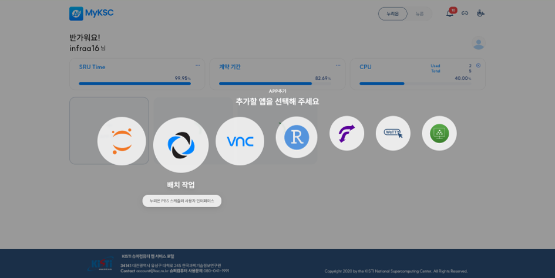<figcaption></figcaption></figure>

2\)뉴론은 SLURM 스케줄러를 사용한다.

<figure>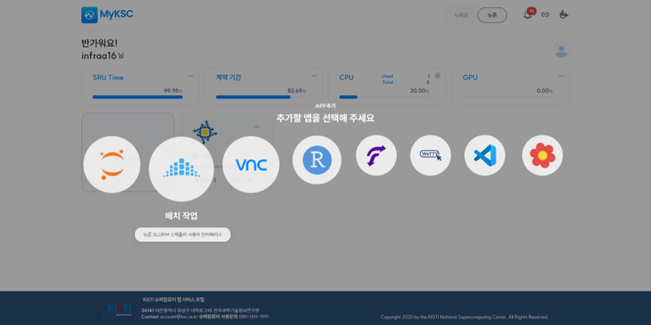<figcaption></figcaption></figure>

#### 2. 이미지를 선택하고 추가 버튼을 클릭한다.

<figure>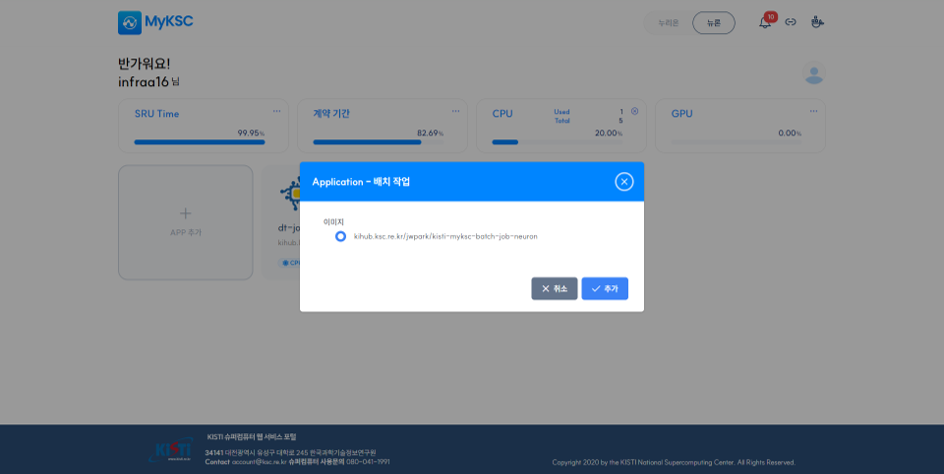<figcaption></figcaption></figure>

#### 3. APP 추가 후 배치 작업 APP을 클릭하면 브라우저의 새로운 탭에서 배치 작업이 실행된다.

<figure>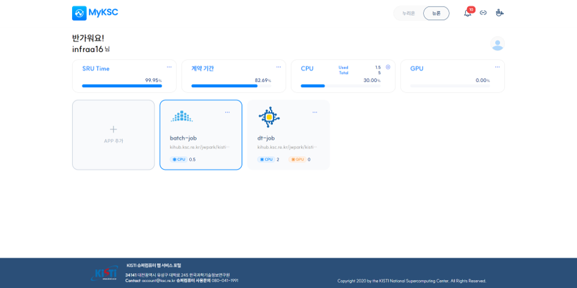<figcaption></figcaption></figure>

<figure>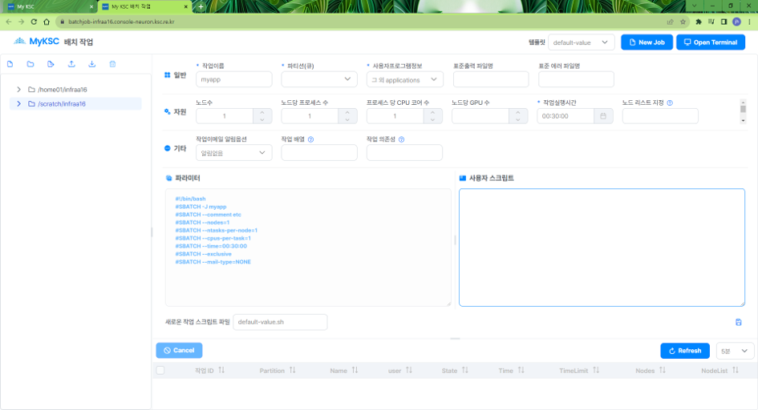<figcaption></figcaption></figure>

#### 4. 화면 구성은 아래와 같다.

<table><thead><tr><th width="84"> </th><th>설명</th></tr></thead><tbody><tr><td>1</td><td>사용자 디렉토리 목록 표시</td></tr><tr><td>2</td><td>사용자 디렉토리 관리 기능 제공 - 파일 생성  - 폴더 생성  - 파일 업로드  - 폴더 업로드  - 파일 다운로드  - 삭제</td></tr><tr><td>3</td><td>선택한 템플릿 형태의 새로운 작업 스크립트를 생성</td></tr><tr><td>4</td><td>작업 실행에 필요한 정보를 작업 스크립트 편집 기능 제공 - 파라미터 입력 - 필수 값 확인 및 도움말</td></tr><tr><td>5</td><td>선택한 파일에 대한 관리 기능 제공  -  파일명 입력  - 파일 저장  - 다른이름으로 저장  - 작업 제출</td></tr><tr><td>6</td><td>실행중인 작업 목록 출력 및 기능 제공 - 목록 자동 갱신 - 작업 상세 정보  - 작업 Cancel</td></tr><tr><td>7</td><td>웹 터미널 열기(삭제됨)</td></tr><tr><td>8</td><td>텍스트 편집 기능 제공 - 작업 스크립트 파일이 아닌 텍스트 형태의 파일을 선택할 경우 해당 파일의 정보를        텍스트 형태로 표시 - 해당 스케줄러의 작업 스크립트 파일이 아닌 경우에도 일반 파일로 표시</td></tr></tbody></table>

<figure>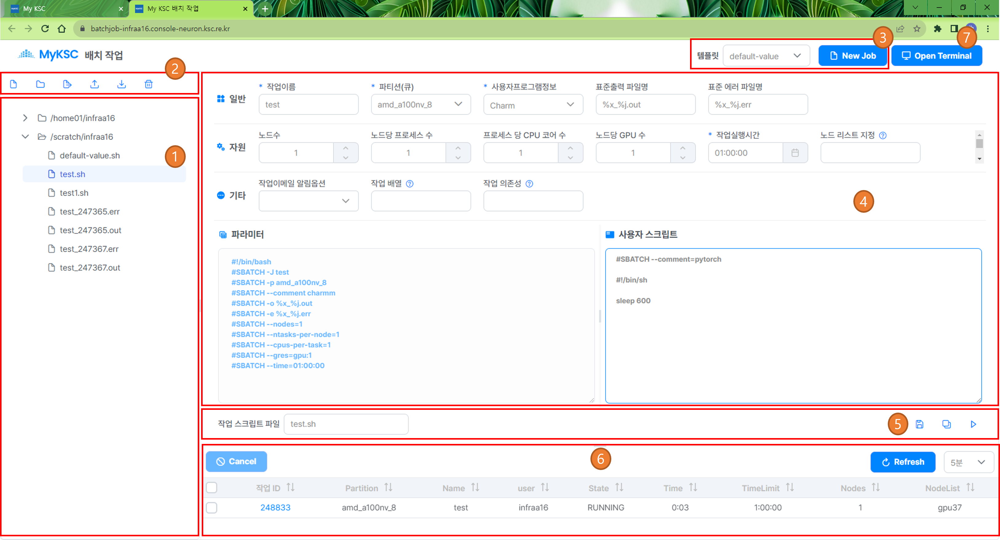<figcaption></figcaption></figure>

<figure>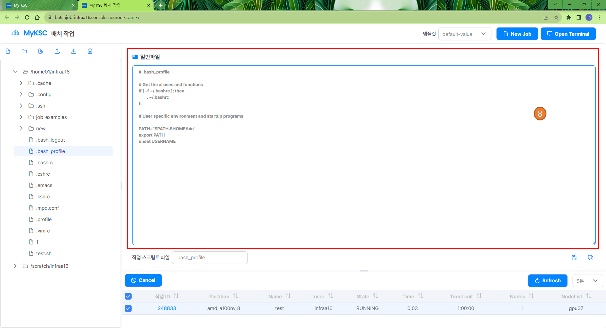<figcaption></figcaption></figure>

#### 5.  파일 목록에 대한 Context menu 기능을 제공한다.

1\)폴더 or 파일 우 클릭 시 화면에  표시한다.

2\) 파일 생성, 폴더 생성, 파일 업로드, 폴더 업로드, 파일 다운로드, 잘라내기, 복사, 붙여넣기, 삭제, 이름 바꾸기, 속성 기능을 제공한다.

<figure>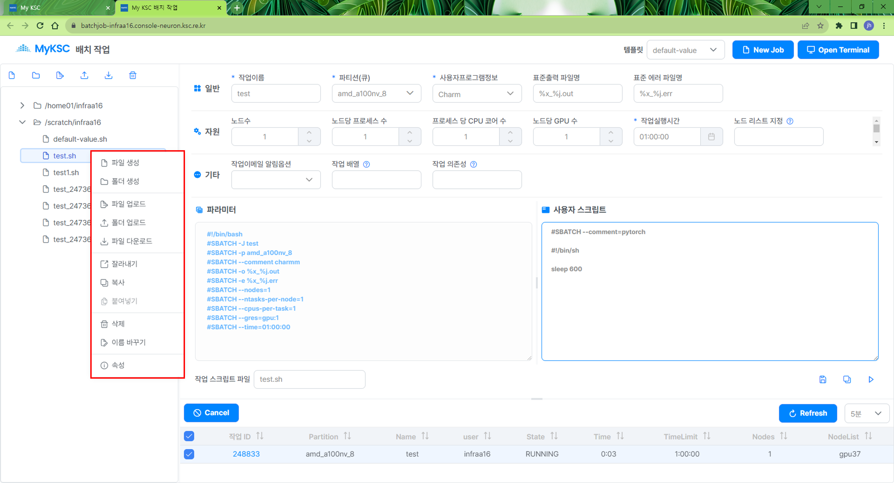<figcaption></figcaption></figure>

#### 6. 폴더 or 파일에 대한 Drag and Drop 기능을 제공한다.

<figure>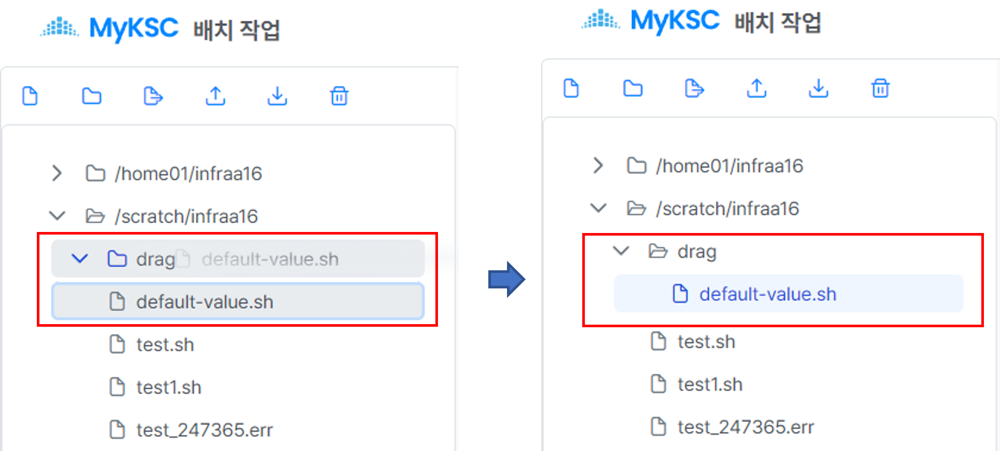<figcaption></figcaption></figure>

#### 7. 새로운 작업을 생성 방법은 아래와 같다.

1\) 디렉토리 목록에서 작업파일을 저장할 위치를 선택한다.

2\) 템플릿 선택 후 New Job 버튼을 클릭하면 해당 템플릿의 내용으로 파라미터가 설정된다.

3\) 추가적인 파라미터 설정이 완료되면 새로운 작업 스크립트 파일 이름을 입력하고 저장 버튼을 클릭하면 작업 파일이 생성된다.

<figure>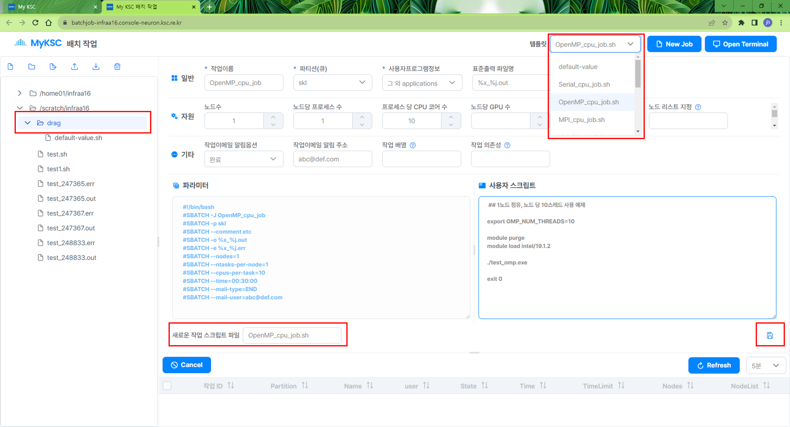<figcaption></figcaption></figure>

#### 8. 작업 목록에서 작업ID를 클릭하면 상세 정보를 확인 화면에 표시한다.

<figure>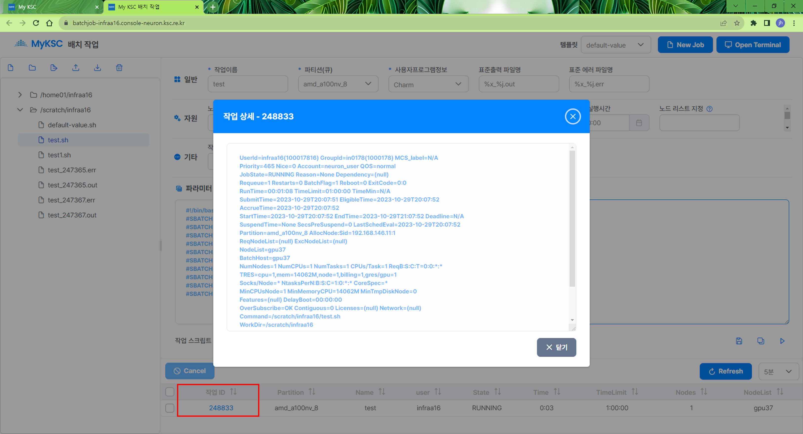<figcaption></figcaption></figure>

#### 9. 작업 목록에서 작업의체크박스를 클릭하여 작업을 선택하고 Cancel 버튼을 클릭하면 선택한 작업을 Cancel한다.

<figure>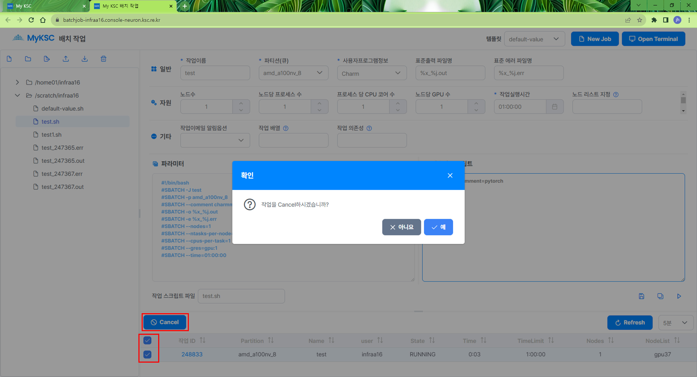<figcaption></figcaption></figure>

