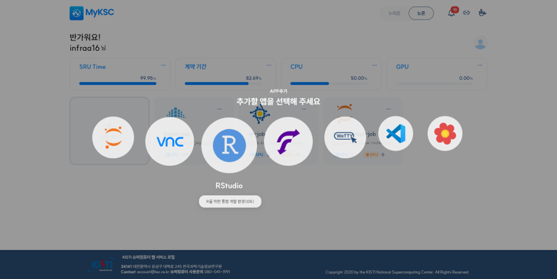
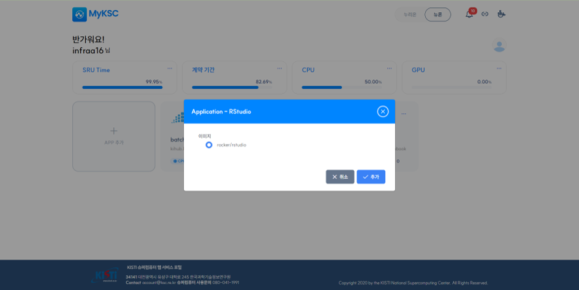
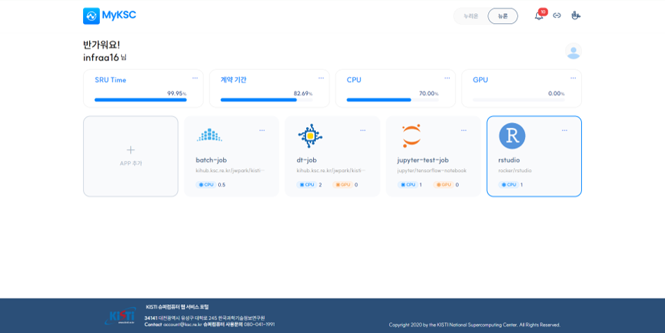
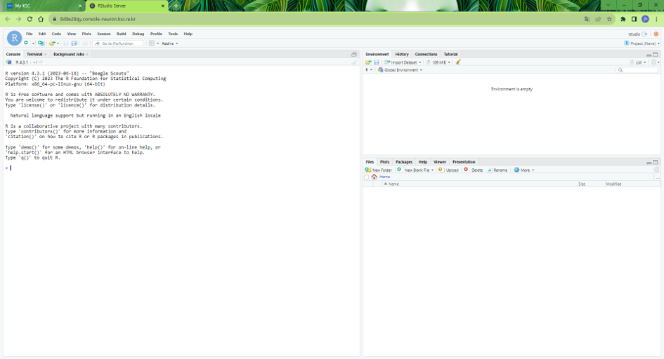

# RStudio

#### &#x20;  1. APP 추가 클릭 후 추가할 앱 선택 화면에서 RStudio를 선택한다.

<figure><figcaption></figcaption></figure>

#### &#x20;  2. 이미지를 선택하고 추가 버튼을 클릭한다.

<figure><figcaption></figcaption></figure>

#### &#x20;3. APP 추가 후 RStudio APP을 클릭하면 브라우저의 새로운 탭에서 RStudio가 실행된다.

<figure><figcaption></figcaption></figure>

<figure><figcaption></figcaption></figure>
