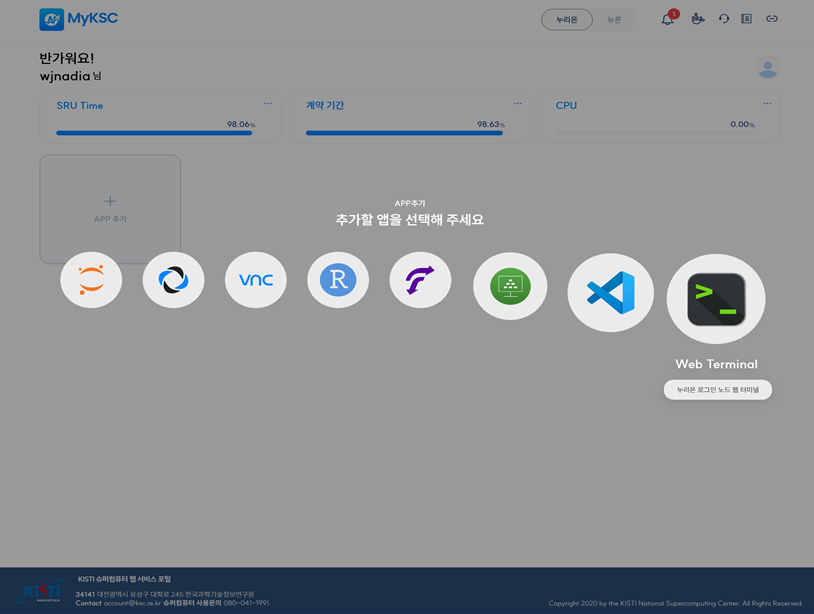
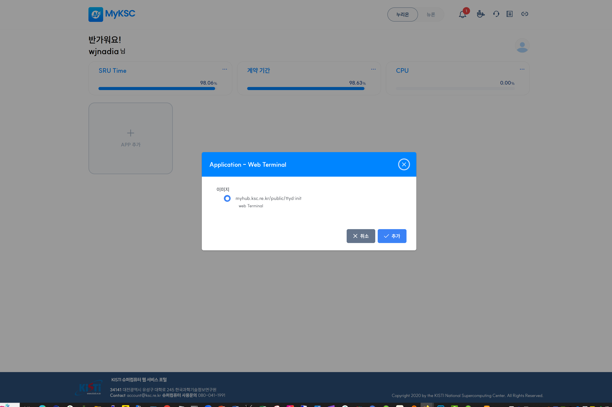
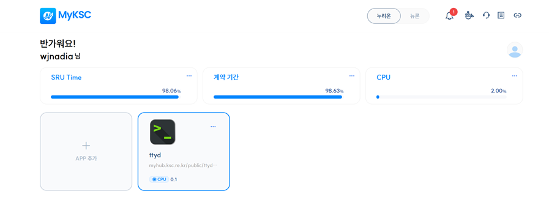
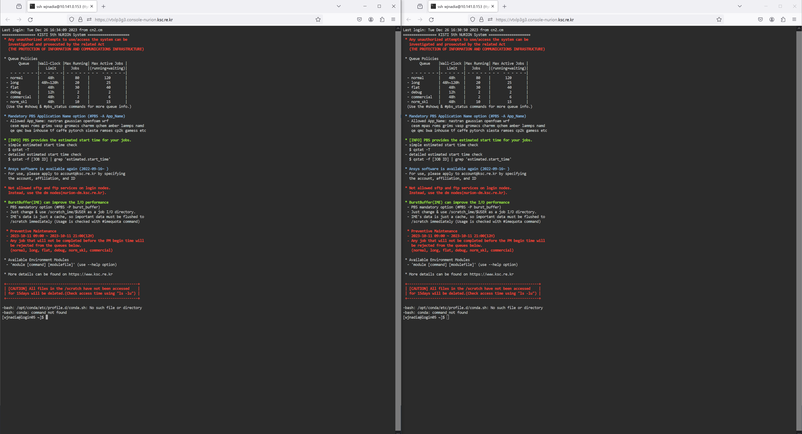
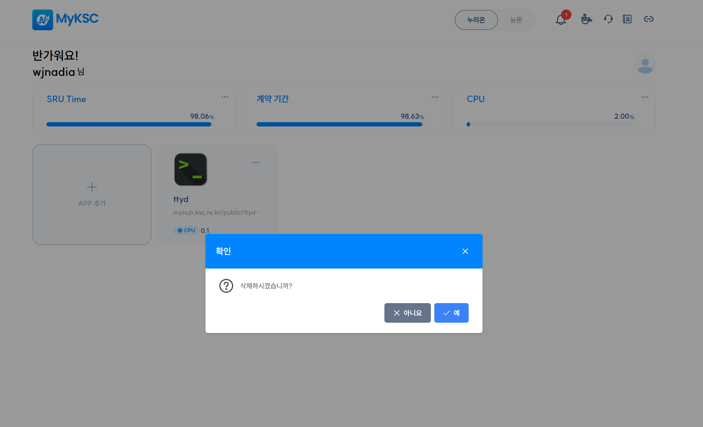
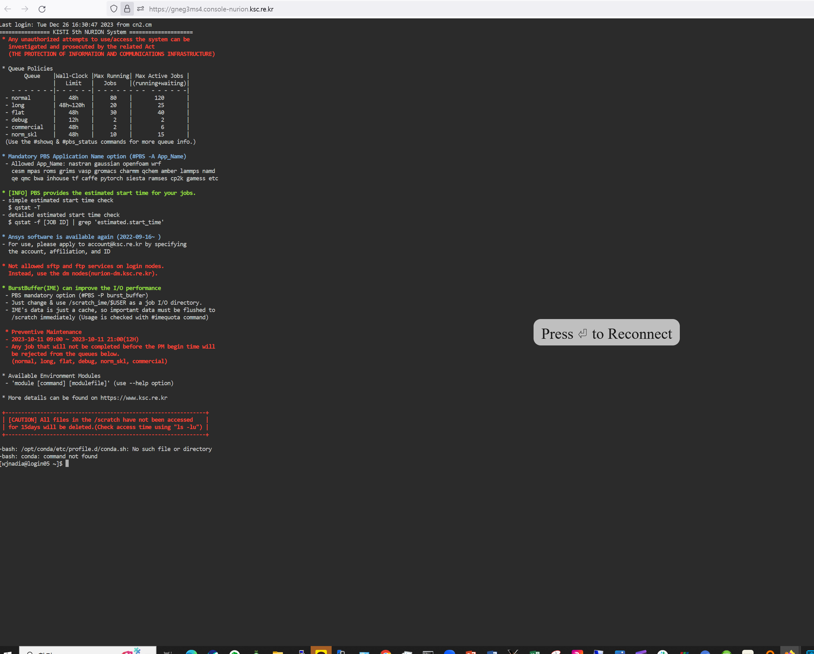

# 웹 터미널(ttyd)

#### 1.     APP 추가 클릭 후 추가할 앱 선택 화면에서 웹 터미널을 선택한다.

<figure><figcaption></figcaption></figure>

#### 2.  이미지를 선택하고 추가 버튼을 클릭한다.

<figure><figcaption></figcaption></figure>

#### 3. APP 추가 후 웹 터미널(ttyd) APP을 클릭하면 브라우저의 새로운 탭에서 웹  터미널이 실행되어 시스템의 로그인 노드에 접속이 된다. 여러 개의  웹 터미널을  실행하기 위해서는 APP을 반복 클릭하면  된다.

<figure><figcaption></figcaption></figure>

<figure><figcaption></figcaption></figure>

#### 4.   웹 터미널의 로그인 노드 접속 과정에서 패스워드를 물어보는 경우에는, [SSH 클라이언트 프로그램(putty 등)을 사용하여 로그인 노드에 접속](https://docs-ksc.gitbook.io/beginner/undefined-1/undefined-1) 후 아래와 같이 조치하면 된다.&#x20;

<figure><figcaption><p>웹 터미널 접속 시 패스워드를 물어보는 경우의 화면</p></figcaption></figure>

* 아래 화면과  같이 사용자  RSA 키가 존재해야 하나 그렇지  않은 경우에는, 사용자  RSA 키를  생성하여 공개키를 authorized\_keys 파일에 추가하는 스크립트(/apps/kube/ttyd/ssh\_rsa-key\_gen.sh)를 실행한다.

```
[wjnadia@login01 ~]$ /apps/kube/ttyd/ssh_rsa-key_gen.sh 
```

<figure><figcaption><p>사용자 홈 디렉터리에 SSH 키가 정상적으로 생성된 화면</p></figcaption></figure>

* 사용자 RSA 키는 존재하나  authorized\_keys 파일에 공개키를 추가하지 않은 경우에는 아래와 같이 조치한다.

```
[wjnadia@login01 ~]$ cd /home01/wjnadia/.ssh
[wjnadia@login01 ~]$ cat id_rsa.pub >> authorized_keys 
```

<figure><figcaption><p>사용자 공개키가 authorized_keys 파일에 정상적으로 추가된 화면</p></figcaption></figure>

#### 5. 터미널 상에서 특정 문자열을 복사하기 위해서는 마우스를 사용하여 해당 문자열을 선택 하며, 복사한 문자열을 붙여넣기 위해서는 커서가 위치한 곳에서 키보드의 \[Ctrl + Shift + v] 키를  동시에 클릭한다.&#x20;

1\) 맥 OS에서 붙여넣기 위해서는 \[Cmd + v] 클릭

#### 6. MyKSC에서 로그아웃 한 이후에도 웹 터미널은 자동 종료되지 않으며, 실행중인 웹 터미널  APP을 삭제하면 기존 웹 터미널 접속도 종료된다.

<figure><figcaption></figcaption></figure>

<figure><figcaption></figcaption></figure>

