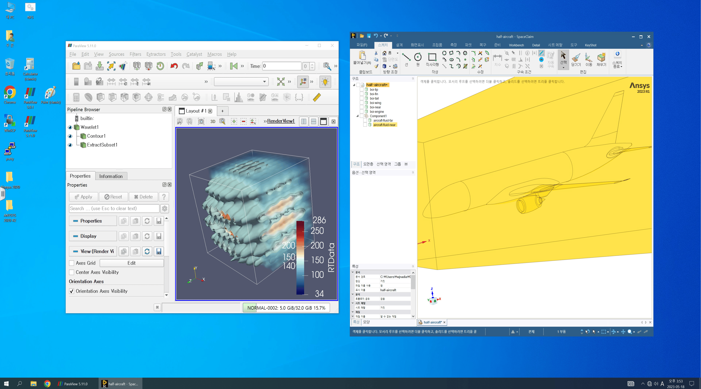

# 데스크톱 가상화(VDI)

#### 1. APP 추가 클릭 후 추가할 앱 선택 화면에서 VDI를 선택하면 브라우저의 새로운 탭에서 VDI 서비스가 시작된다.

<figure><figcaption>
MyKSC 대시보드에서 VDI 서비스 추가 화면
</figcaption></figure>

#### 2. VDI 서비스는 Horizon Client 프로그램을 설치한 후 '기본 클라이언트 시작' 을 통해 사용할 수 있다.&#x20;

1\) 자세한 VDI 사용법은 '누리온  지침서 - APPENDIX : [**데스크톱 가상화(VDI) 사용법**](https://docs-ksc.gitbook.io/nurion-user-guide/undefined-2/appendix-9-how-to-use-vdi)' 참조

<figure><figcaption>
Horizon Client 시작 화면
</figcaption></figure>

<figure><figcaption>
사용자 VM 접속 및 로그인 화면
</figcaption></figure>
