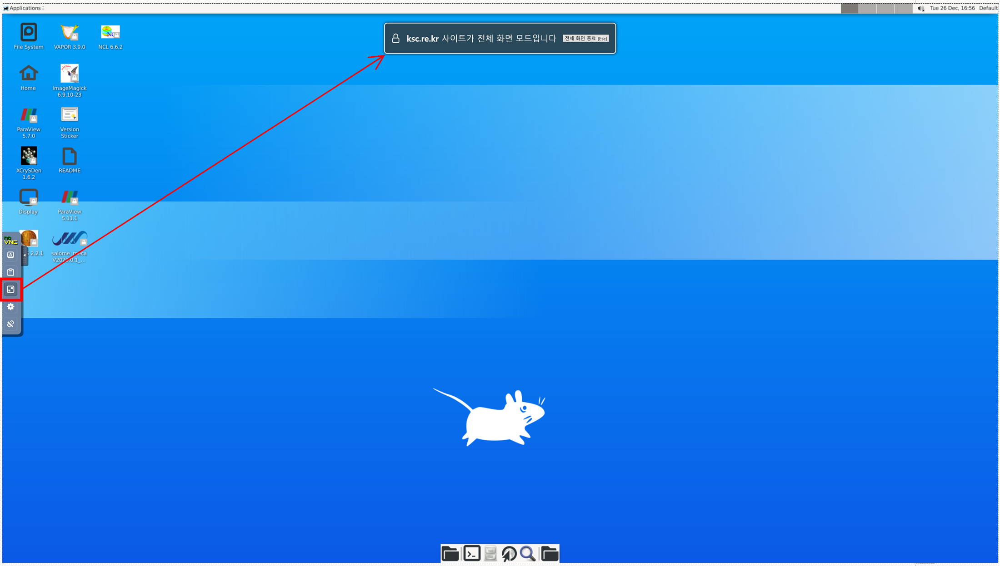

# 원격데스크톱(VNC)

#### 1. APP 추가 클릭 후 추가할 앱 선택 화면에서 VNC를 선택한다.

<figure><figcaption>
VNC 앱 선
</figcaption></figure>

#### 2. 할당 받고자 하는 CPU 수 및 메모리 용량을 선택하고 추가 버튼을 클릭한다.&#x20;

<figure><figcaption>
VNC 앱 추가
</figcaption></figure>

#### 3. APP 추가 후 VNC APP을 클릭하면 브라우저의 새로운 탭에서 원격 데스크톱이 실행되며, 연결 버튼을 클릭하면 데스크톱 화면이 출력된다.

<figure><figcaption>
VNC 앱 실행
</figcaption></figure>

<figure><figcaption>
 VNC 초기 화면
</figcaption></figure>

#### &#x20;4. 바탕 화면에서 설치된 소프트웨어의 아이콘을 클릭하여 실행할 수 있다.


**(설치 소프트웨어)**  &#x20;

Paraview 5.11.1/5.7.0

GrADS 2.2.1

ImageMagick 6.9.10-23

NCL 6.6.2

XCrySden 1.6.2

VAPOR 3.10.1

GaussView 6.1.1

Salome\_meca 9.4.0


<figure><figcaption>
VNC  데스크톱 화면
</figcaption></figure>


&#x20;**(VNC와  외부 프로그램 간  텍스트 "복사/붙여넣기" )**  좌측 컨트롤 바에서 클립보드를 실행하여  텍스트 "복사/붙여넣기" 를 실행한다.


<figure><figcaption>
클립보드를 통해 VNC와 외부 프로그램 간 텍스트 복사/붙여넣기 예시
</figcaption></figure>


**(화면 해상도 설정)** 바탕 화면에서  Display 아이콘을  실행한다.


<figure><figcaption>
화면 해상도 설정하기
</figcaption></figure>


**(전체 화면 모드로 전환하기)** 좌측 컨트롤 바에서 전체 화면 메뉴를 실행한다.


<figure><figcaption>
전체 화면 모드로 전환하기
</figcaption></figure>

