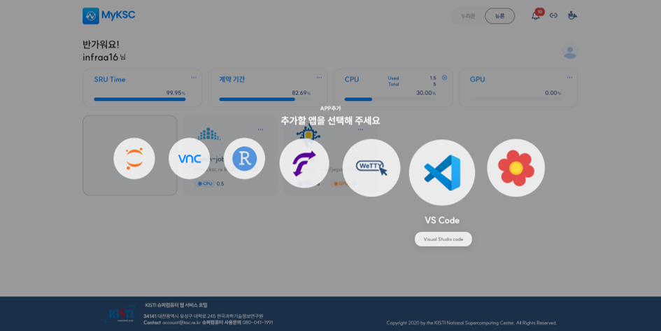
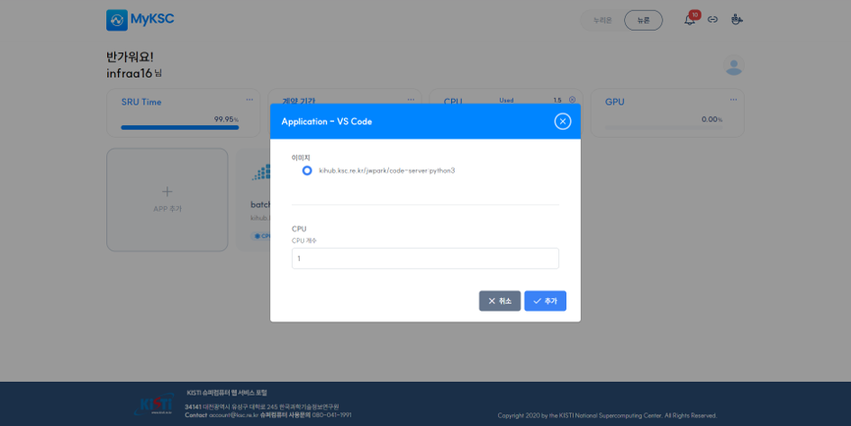
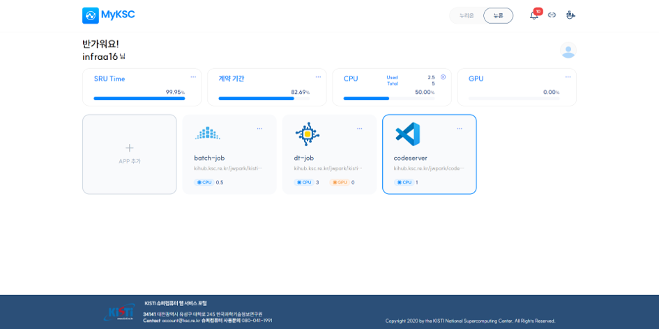
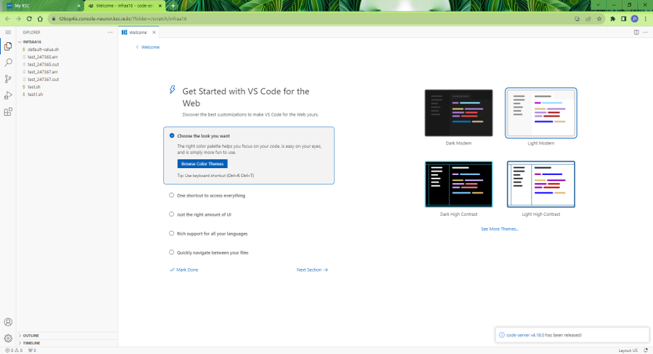

# VS(Visual Studio) Code

#### 1. APP 추가 클릭 후 추가할 앱 선택 화면에서 VS Code를 선택한다.

<figure><figcaption></figcaption></figure>

#### 2. 이미지를 선택하고 추가 버튼을 클릭한다.

<figure><figcaption></figcaption></figure>

#### 3. APP 추가 후 VS Code APP을 클릭하면 브라우저의 새로운 탭에서 VS Code가 실행된다.

<figure><figcaption></figcaption></figure>

<figure><figcaption></figcaption></figure>

##

## 아
