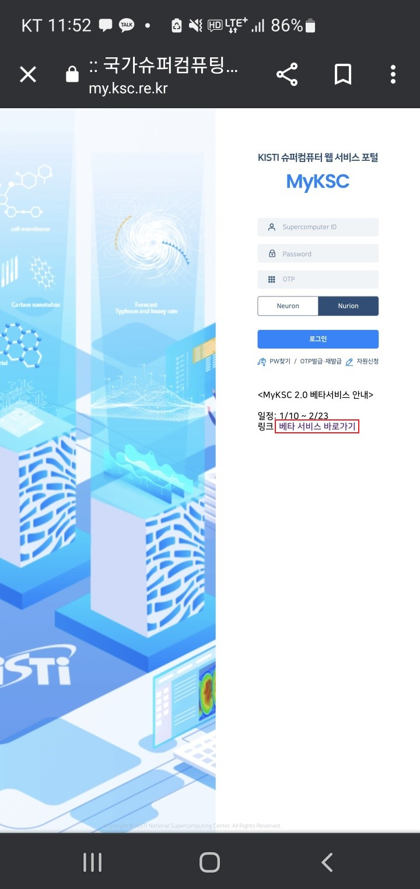

# 설치 및 알림 설정

### 가. 로그인&#x20;

#### 1. 모바일 웹 브라우저를 실행하여 [https://portal.my.ksc.re.kr](https://portal.my.ksc.re.kr) 에 접속한다.

1\) MyKSC 앱 설치 사용자는 홈 화면 또는 앱스 화면에 위치한 My KSC 앱을 실행한다.

<figure><figcaption></figcaption></figure>

#### 2. 슈퍼컴퓨터 사용자 아이디 및 비밀번호, OTP를 입력하고 접속할 시스템 (누리온/뉴론)을 선택 후    로그인 한다.

1\) 현재 MyKSC는 슈퍼컴퓨터 사용자 아이디를 발급 받은 사용자를 위한 서비스이며, 슈퍼컴퓨터 ID 발급 절차는 국가센터 홈페이지(https://www.ksc.re.kr)를 따름

<figure><figcaption></figcaption></figure>

#### 3. 시스템(누리온/뉴론) 점검 중에는 해당 시스템에 로그인이 제한된다.

<figure><figcaption></figcaption></figure>

## 나. 안드로이드에서 설치 및 알림 설정

#### 1. 로그인 화면에 표시된 MyKSC 앱 설치 방법에 따라 설치를 진행한다.

1\) 사용자의 모바일 브라우저에 따라 설치 방법이 다를 수 있기 때문에 차이가 있는 경우 모바일 기기       화면에 표시된 설치 방법으로 진행한다.

2\) Chrome 브라우저의 설치는 '메뉴 아이콘 선택' -> '앱 설치 또는 홈 화면에 추가 선택' -> '설치 선택' 순서로 진행한다.

<figure><figcaption>
<strong>메뉴 아이콘 선택                                             앱 설치 또는 홈 화면에 추가 선택                                                     설치 선택</strong>    
</figcaption></figure>

3\) Samsung 브라우저의 설치는 '설치 아이콘 선택' -> '설치 선택' 순서로 진행한다.

<figure><figcaption>
<strong>설치 아이콘 선택                                                                                                                          설치 선택</strong>     
</figcaption></figure>

4\) Firefox 브라우저의 설치는 '메뉴 아이콘 선택' -> '설치 또는 홈 화면에 추가 선택' -> '추가 선택' 순서로 진행한다.

<figure><figcaption>
<strong>메뉴 아이콘 선택                                                 설치 또는 홈 화면에 추가 선택                                                       추가 선택</strong>       
</figcaption></figure>

5\) 설치가 완료되면 홈 화면 또는 앱스 화면에 MyKSC 앱이 생성된다.

<figure><figcaption>
      <strong>홈 화면                                                                           앱스 화면                                                                  홈 화면(Firefox)</strong>
</figcaption></figure>

#### 2. 알림 수신을 설정한다.

1\) 알림 수신을 설정할 경우 MyKSC 에서 제공하는 유용한 알림 메시지를 수신 가능하다.

2\) 홈 화면 또는 앱스 화면에 위치한 My KSC 앱을 실행하여 로그인 한다.

3\) Chrome 브라우저 와 Samsung 브라우저의 경우 '허용요청 선택' -> '허용 선택' 순서로 진행한다.

<figure><figcaption>
<strong>허용요청 선택                                                                                                                        허용 선택</strong>     
</figcaption></figure>

4\) Firefox 브라우저의 경우 '허용 선택' -> '허용요청 선택' -> '항상 선택' 순서로 진행한다.

<figure><figcaption>
<strong>허용 선택                                                                      허용요청 선택                                                                      항상 선택</strong>
</figcaption></figure>

5\) 알림 권한 설정이 완료되면 성공 메시지를 표시한다. (모바일 기기에 따라 알림 수신 권한이 제한되어  권한 설정이 불가한 경우가 발생)

<figure><figcaption></figcaption></figure>

6\) 알림 수신 설정은 최초 1회 진행되며 설정 이후에는 활성화되지 않는다.

#### 3. 설치 과정에서 알림 요청을 하지 않은 사용자 또는 알림 수신을 취소할 경우 아래 내용을 참고하여 알림  수신 상태를 설정한다.

1\) 핸드폰 설정 메뉴로 이동하여 애플리케이션 메뉴를 선택한다.

<figure><figcaption></figcaption></figure>

2\) 앱 목록을 스크롤 하거나 검색 기능을 사용하여 MyKSC 앱을 선택한다.

<figure><figcaption></figcaption></figure>

3\) 알림을 선택한다.

<figure><figcaption></figcaption></figure>

4\) 알림 허용 여부를 설정한다.

<figure><figcaption></figcaption></figure>

## 다. IOS에서 설치 및 알림 설정

#### 1. 로그인 화면에 표시된 MyKSC 앱 설치 방법에 따라 설치를 진행한다.

1\) 사용자의 모바일 브라우저에 따라 설치 방법이 다를 수 있기 때문에 차이가 있는 경우 모바일 기기       화면에 표시된 설치 방법으로 진행한다.

2\) Safari 브라우저는 메뉴바의 공유 아이콘을 선택하고 Chrome 브라우저는 주소창의 공유 아이콘을     선택한다.

<figure><figcaption>
<strong>Safari 브라우저</strong>                                                                                  <strong>Chrome 브라우저</strong>
</figcaption></figure>

3\) 홈 화면에 추가를 선택한다.

<figure><figcaption></figcaption></figure>

4\) 추가를 선택한다.

<figure><figcaption></figcaption></figure>

5\) 홈 화면에 MyKSC 앱이 생성된다.

<figure><figcaption></figcaption></figure>

#### 2. 알림 수신을 설정한다.

1\) 알림 수신을 설정할 경우 MyKSC 에서 제공하는 다양한 알림 메시지를 수신 가능하다.

2\) 홈 화면에 위치한 My KSC 앱을 실행하여 로그인 한다.

3\) 알림 권한 설정에서 허용요청을 선택한다.

<figure><figcaption></figcaption></figure>

4\) 허용을 선택한다.

<figure><figcaption></figcaption></figure>

5\) 알림 권한 설정이 완료되면 성공 메시지를 표시한다. (모바일 기기에 따라 알림 수신 권한이 제한되어  권한 설정이 불가한 경우가 발생)

<figure><figcaption></figcaption></figure>

6\) 알림 수신 설정은 최초 1회 진행되며 설정 이후에는 활성화되지 않는다.

#### 3. 설치 과정에서 알림 요청을 하지 않은 사용자 또는 알림 수신을 취소할 경우 아래 내용을 참고하여 알림  수신 상태를 설정한다.

1\) 핸드폰 설정 메뉴로 이동 후, 애플리케이션 목록에서 MyKSC 앱을 선택한다.

<figure><figcaption></figcaption></figure>

2\) 알림을 선택한다.

<figure><figcaption></figcaption></figure>

3\) 알림 허용 여부를 설정한다.

<figure><figcaption></figcaption></figure>

