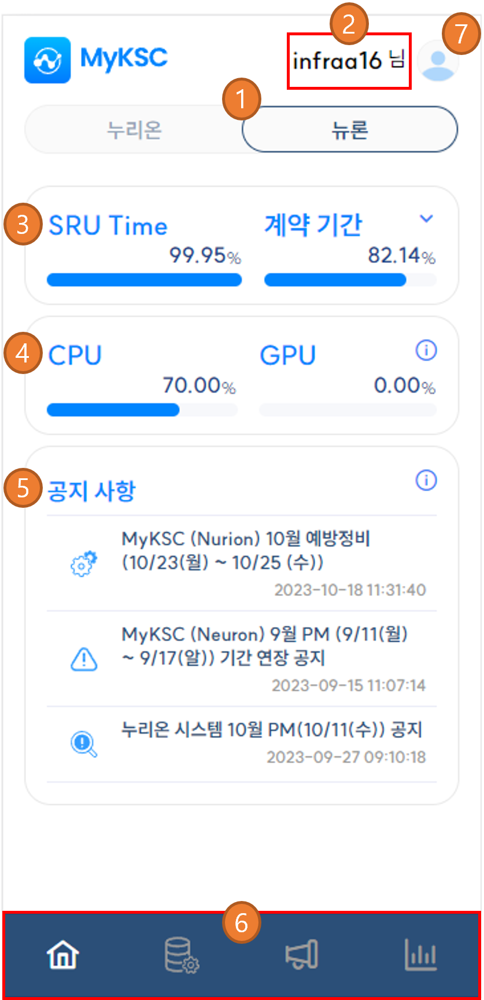

# 대시보드 구성

<table><thead><tr><th width="67"> </th><th>설명</th></tr></thead><tbody><tr><td>1</td><td>누리온 / 뉴론 시스템 선택</td></tr><tr><td>2</td><td>사용자 정보 표시</td></tr><tr><td>3</td><td>SRU Time, 계약 기간 표시</td></tr><tr><td>4</td><td>자원 사용량 표시</td></tr><tr><td>5</td><td>공지 사항 표시</td></tr><tr><td>6</td><td>화면 이동 메뉴</td></tr><tr><td>7</td><td>사용자 메뉴  - 마이 페이지, 로그아웃 기능을 제공한다.</td></tr></tbody></table>

<figure><figcaption></figcaption></figure>

##
