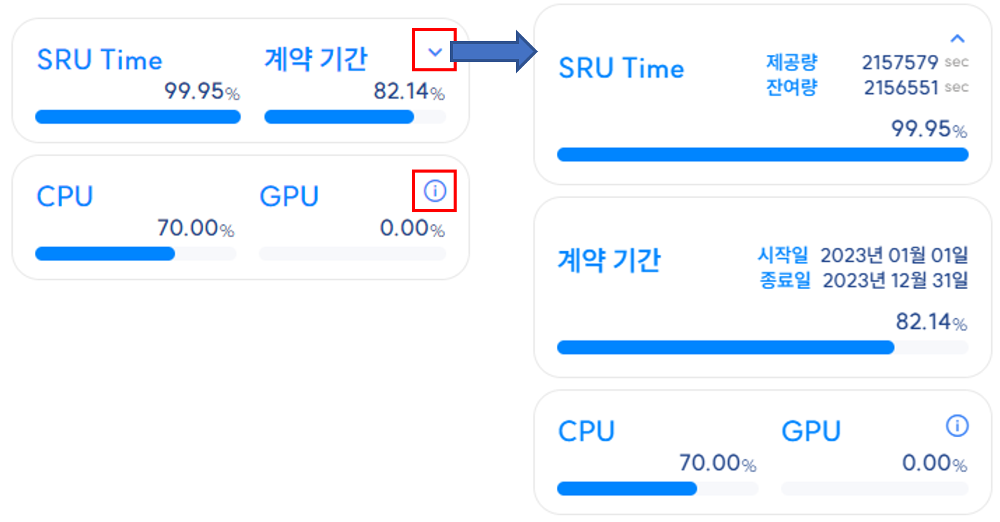
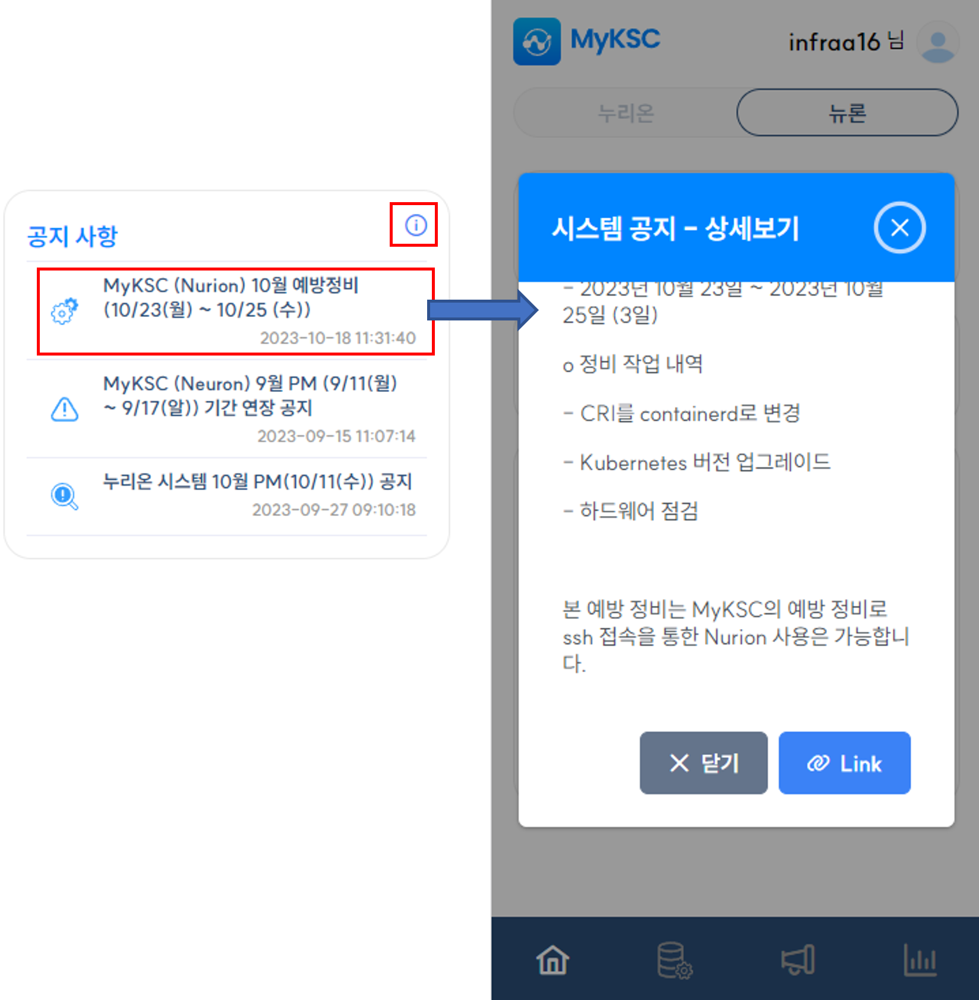
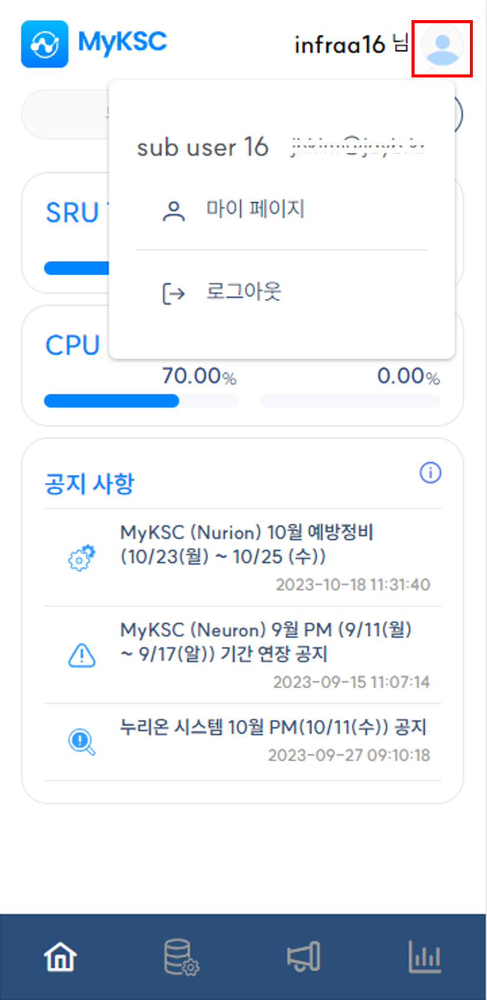
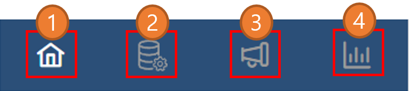
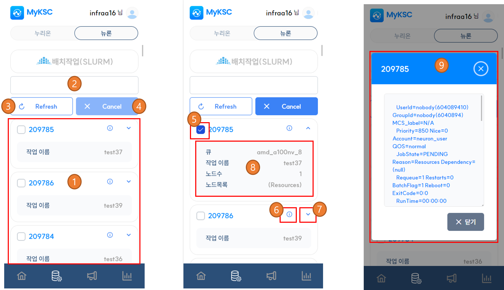
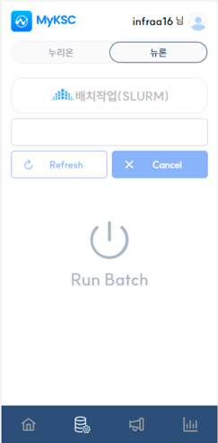
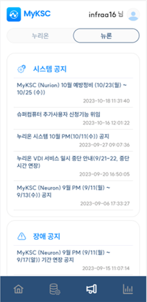
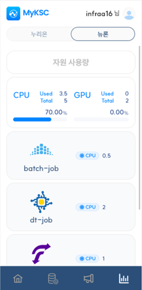

# 메뉴 및 화면 구성

## 가. 계약  정보 및 자원 사용량

#### 1. 사용자의 SRU Time, 계약 기간, 자원 사용량(CPU 코어수, GPU 수)을 그래프와 텍스트로 표시한다.

#### 2. 사용자의 SRU Time, 계약 기간 우측 상단의 아이콘을 클릭하면 상세정보를 표시한다.

#### 3. 자원 사용량 우측 상단의 아이콘을 클릭하면 자원 사용량 화면으로 이동한다.

#### 4. SRU Time는 제공량과 잔여량을 표시하며 그래프의 값은 남은 잔여량을 의미한다.

#### 5. 계약 기간은 시작일과 종료일을 표시하며 그래프의 값은 남은 기간을 의미한다.

#### 6. 자원 사용량(CPU, GPU) 그래프의 값은 현재 사용률을 의미한다.

1\) 현재 누리온 시스템에서는 GPU를 지원하지 않음

<figure><figcaption></figcaption></figure>

## 나. 공지 사항

#### 1. 시스템 공지, 장애 공지, 점검 공지 각각에 대한 최신 목록 1개만 표시한다.&#x20;

#### 2. 우측에 위치한 아이콘을 선택하면 공지 사항 화면으로 이동한다.

#### ㄷ3. 공지를 선택하면 해당 공지에 대한 상세보기를 제공하며 Link 버튼을 클릭하면 해당 공지가 작성된         사이트로 이동한다.

<figure><figcaption></figcaption></figure>

## 다. 사용자 메뉴

#### 1. 마이 페이지, 로그아웃 기능을 제공한다.&#x20;

<figure><figcaption></figcaption></figure>

#### 2.  마이 페이지를 선택하면 국가슈퍼컴퓨팅센터(www.ksc.re.kr)의 마이 페이지 사이트로 이동한다.

#### 3. 로그아웃을 선택하면 로그아웃 처리되어 로그인 화면으로 이동한다.

## 라. 화면 이동 메뉴

<table><thead><tr><th width="75"> </th><th> 설명</th></tr></thead><tbody><tr><td>1</td><td>대시보드 화면으로 이동</td></tr><tr><td>2</td><td>작업 관리 화면으로 이동</td></tr><tr><td>3</td><td>공지 사항 화면으로 이동</td></tr><tr><td>4</td><td>자원 사용량 화면으로 이동</td></tr></tbody></table>

<figure><figcaption></figcaption></figure>

## 마. 작업 관리 화면

#### 1. 배치작업 모니터링 및 작업 관리 기능을 제공한다.

<table><thead><tr><th width="90"> </th><th>설명</th></tr></thead><tbody><tr><td>1</td><td>작업 목록을 표시한다.</td></tr><tr><td>2</td><td>작업 목록 검색을 위한 검색어를 입력한다.</td></tr><tr><td>3</td><td>작업 목록을 갱신한다.</td></tr><tr><td>4</td><td>선택된 작업을 Cancel한다.</td></tr><tr><td>5</td><td>해당 작업을 선택한다.</td></tr><tr><td>6</td><td>상세 정보를 표시하기 위한 아이콘</td></tr><tr><td>7</td><td>일반 정보를 표시하기 위한 아이콘</td></tr><tr><td>8</td><td>상세 정보를 표시한다. - PBS인 경우 큐, 작업 이름, 노드수(NDS), CPU 코어 수(TSK) 표시 - SLURM인 경우 큐, 작업 이름, 노드수, 노드목록 표시</td></tr><tr><td>9</td><td>상세 정보를 표시한다.</td></tr></tbody></table>

<figure><figcaption></figcaption></figure>

#### 2.  배치 작업 관리 서비스가 실행 중이지 않을 경우 해당 서비스를 실행 할 수 있다.

1\) Run Batch 아이콘을 터치하면 서비스를 실행한다.

<figure><figcaption></figcaption></figure>

## 바. 공지 사항 화면

#### 1. 시스템 공지, 장애 공지, 점검 공지 목록 표시한다.

#### 2. 공지를 선택하면 해당 공지에 대한 상세보기를 제공하며 Link 버튼을 클릭하면 해당 공지가 작성된         사이트로 이동한다.

<figure><figcaption></figcaption></figure>

## 사. 자원 사용량 화면&#x20;

#### 1. 각 자원 사용량에 대한 상세 정보 표시한다.

#### 2. 현재 실행중인 서비스와 각 서비스가 사용중인 자원 정보 표시한다.

1\) 현재 누리온 시스템에서는 GPU를 지원하지 않음

<figure><figcaption></figcaption></figure>
