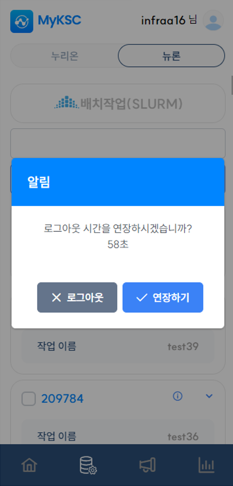

# 로그인 연장

#### 1. 로그인 후 일정 시간이 지나면 사용자에게 로그인 연장 여부를 요청한다.

#### 2. 로그인 연장을 원할 경우 연장하기 버튼을 선택하면 로그인이 연장된다.

#### 3. 60초간 응답이 없는 경우 로그아웃 처리되어 로그인 화면으로 이동한다.

<figure><figcaption></figcaption></figure>

&#x20;
