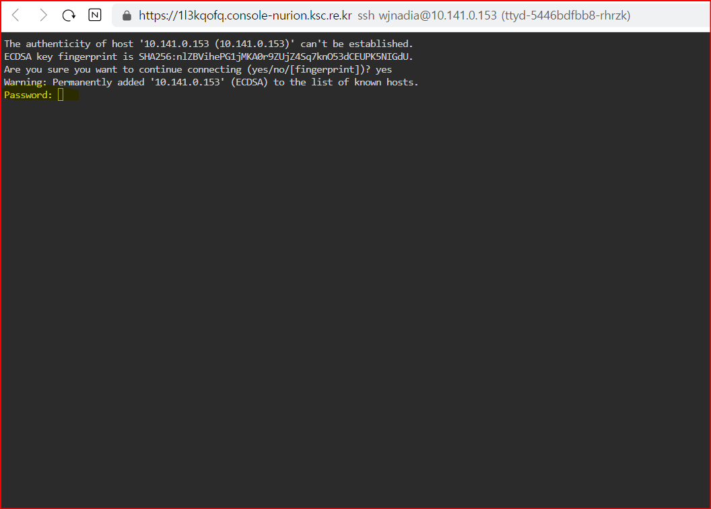

# 웹 터미널 접속 관련 문제 조치 방법

#### &#x20;1. 웹 터미널의 로그인 노드 접속 과정에서 패스워드를 물어보는 경우에는, [SSH 클라이언트 프로그램(putty 등)을 사용하여 로그인 노드에 접속](https://docs-ksc.gitbook.io/beginner/undefined-1/undefined-1) 후아래와 같이 조치하면 된다.&#x20;

<figure><figcaption><p>웹 터미널 접속 시 패스워드를 물어보는 경우의 화면</p></figcaption></figure>

* 아래 화면과  같이 사용자  RSA 키가 존재해야 하나 그렇지  않은 경우에는, 사용자  RSA 키를  생성하여 공개키를 authorized\_keys 파일에 추가하는 스크립트(/apps/kube/ttyd/ssh\_rsa-key\_gen.sh)를 실행한다.

```
[wjnadia@login01 ~]$ /apps/kube/ttyd/ssh_rsa-key_gen.sh 
```

<figure><figcaption><p>사용자 홈 디렉터리에 SSH 키가 정상적으로 생성된 화면</p></figcaption></figure>

* 사용자 RSA 키는 존재하나  authorized\_keys 파일에 공개키를 추가하지 않은 경우에는 아래와 같이 조치한다.

```
[wjnadia@login01 ~]$ cd /home01/wjnadia/.ssh
[wjnadia@login01 ~]$ cat id_rsa.pub >> authorized_keys 
```

<figure><figcaption><p>사용자 공개키가 authorized_keys 파일에 정상적으로 추가된 화면</p></figcaption></figure>

