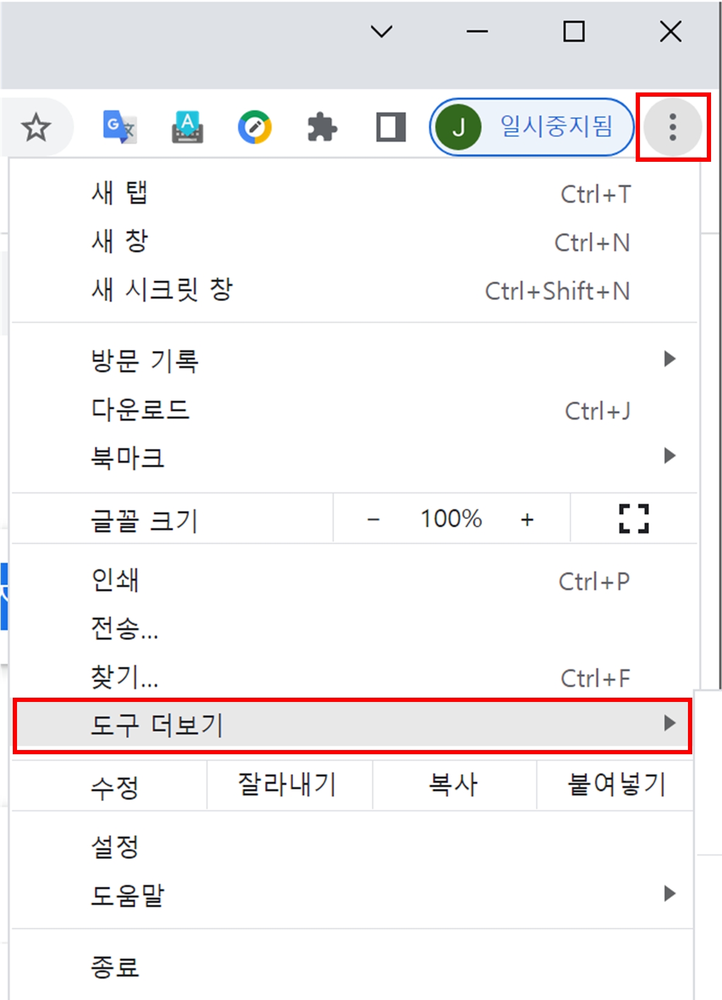
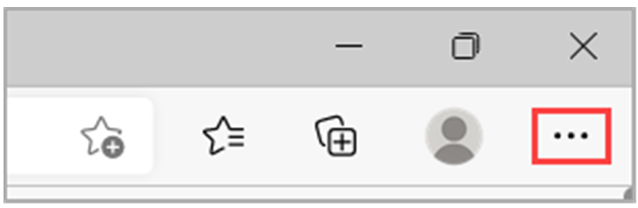

# 캐시 및 쿠키 삭제 방법

#### 1. Chrome(크롬)

1\) 크롬 브라우저의 오른쪽 상단에서 더보기를 클릭합니다.

2\) 도구 더보기 인터넷 사용 기록 삭제를 클릭합니다.

3\) 상단에서 기간을 선택합니다. 모든 항목을 삭제하려면 전체를 선택합니다.

4\) '쿠키 및 기타 사이트 데이터'와 '캐시된 이미지 또는 파일' 옆의 체크박스를 선택합니다.

5\) 인터넷 사용 기록 삭제를 클릭합니다.

<figure><figcaption></figcaption></figure>

#### 2. Microsoft Edge(엣지)

1\) Edge에서 브라우저 창의 오른쪽 위 모서리에서 설정 및 기타를 선택합니다.

2\) 설정 > 개인 정보, 검색 및 서비스를 선택합니다.

3\) 검색 데이터 지우기> 지금 검색 데이터 지우기에서 지울 항목 선택을 선택합니다.

4\) 시간 범위의 목록에서 시간 범위를 선택합니다.

5\) 쿠키 및 기타 사이트 데이터를 선택한 다음 지금 지우기를 선택합니다.

<figure><figcaption></figcaption></figure>

## ㅇㄹ
