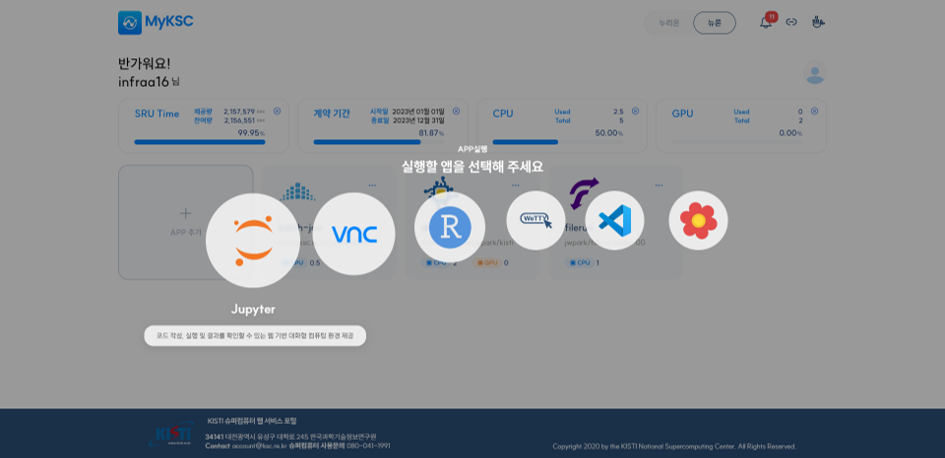
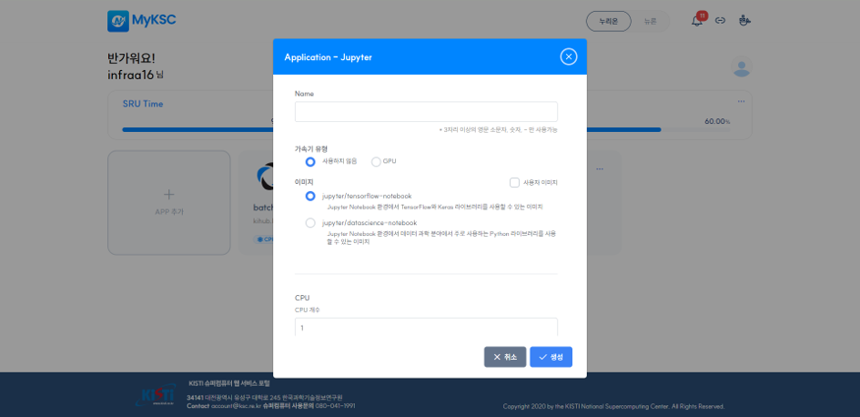
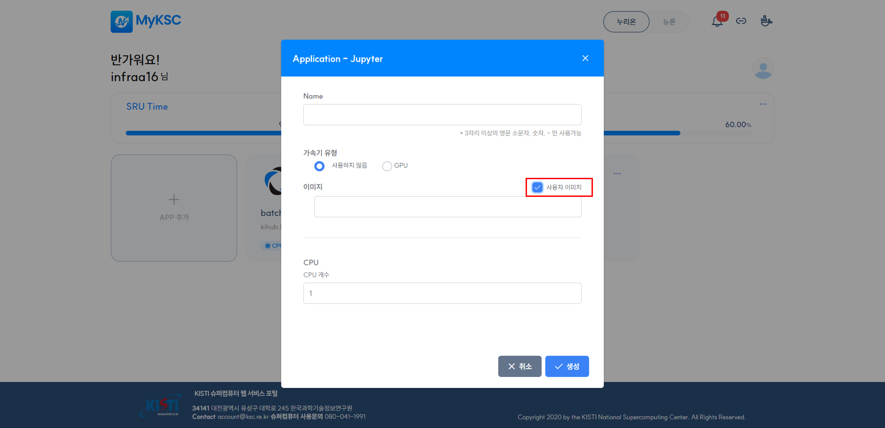
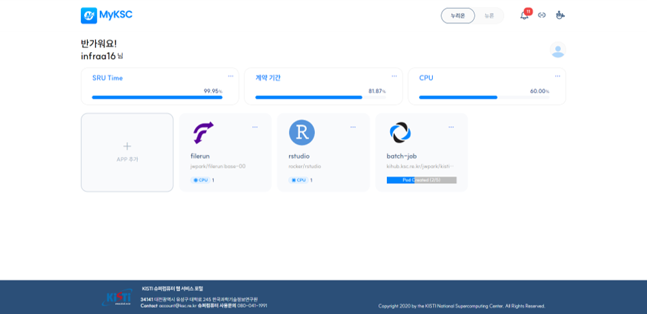
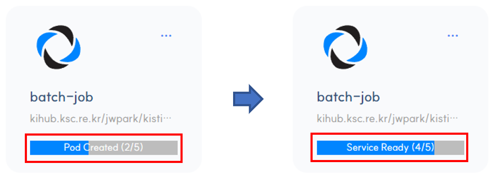
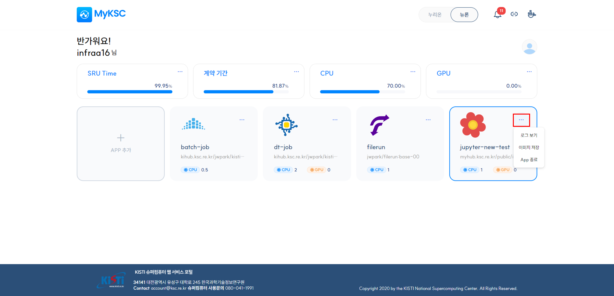
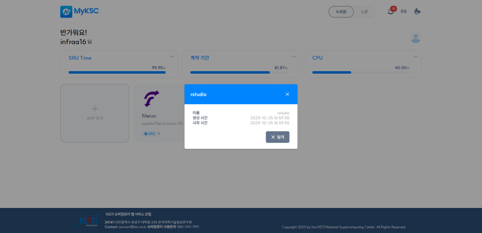
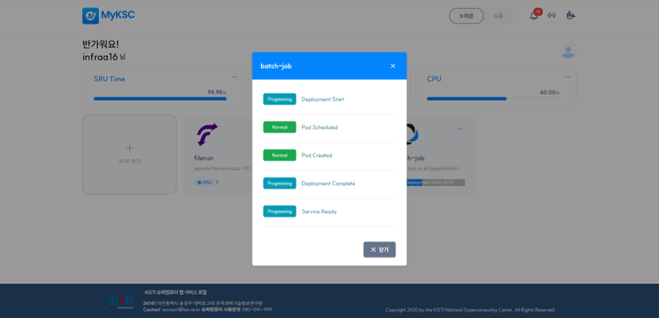

# 서비스(APP) 실행 및 사용

### 가. 서비스(APP) 실행

#### 1. Application 추가 클릭 시 Application 추가 화면이 표시된다.

#### 2. 추가를 원하는 Application을 선택한다.

1\) Application에 따라 추가 없이 바로 브라우저에 출력 될 수 있다.

2\) Application에 따라 1개 또는 여러개의 Application을 추가 할 수 있다.

<figure><figcaption></figcaption></figure>

#### 3. Application 추가에 필요한 정보를 입력한다.

1\) Application에 따라 필요한 정보가 변경된다.

2\) Application에 따라 사용자 이미지를 사용하여 추가할 수 있다.

<figure><figcaption></figcaption></figure>

<figure><figcaption></figcaption></figure>

#### 4. 추가 버튼을 클릭하면 Application 추가한다.

#### 5. 화면에 추가한 Application 과 진행 상황을 표시한다.

<figure><figcaption></figcaption></figure>

<figure><figcaption></figcaption></figure>

###

### 나. 서비스(APP) 사용 및 삭제

#### 1. Application을 클릭하면 웹 브라우저를 통해 해당 Application에 접근 할 수 있다.

#### 2. 로그 보기, APP 삭제 기능을 제공하며 해당 기능은 우측 아이콘을 클릭하면 표시된다.

<figure><figcaption></figcaption></figure>

#### 3. 로그 보기는 현재 Application의 로그를 확인 할 수 있다.

1\) 추가 중, 삭제 중 일 경우에는 진행 상태에 대한 정보를 표시한다.

<figure><figcaption></figcaption></figure>

<figure><figcaption></figcaption></figure>

#### 4. APP 삭제를 선택하면 해당 Application을 삭제한다
