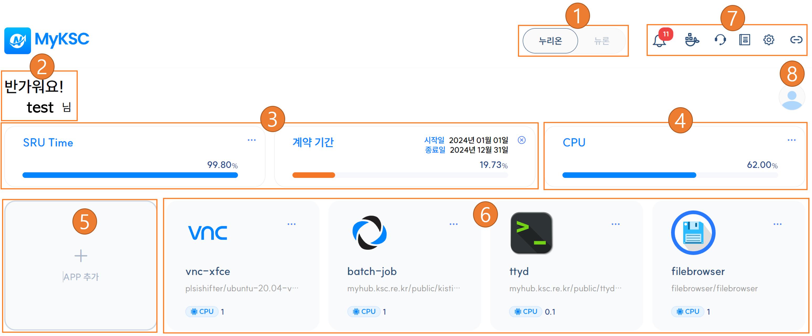
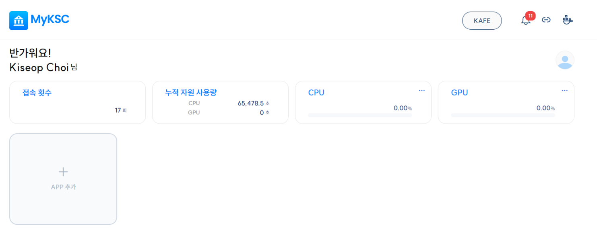

# 대시보드 화면 구성

<table><thead><tr><th width="73"> </th><th>설명</th></tr></thead><tbody><tr><td>1</td><td>누리온 / 뉴론 시스템 선택 - KAFE 사용자는 선택불가</td></tr><tr><td>2</td><td>사용자 정보 표시</td></tr><tr><td>3</td><td>SRU Time, 계약 기간 표시 - KAFE 사용자는 접속 횟수 , 누적 자원 사용량 을 표시한다.</td></tr><tr><td>4</td><td>자원 사용량 표시</td></tr><tr><td>5</td><td>Application 추가</td></tr><tr><td>6</td><td>실행 중인 Application  표시 - Application 이름, 사용한 Image 이름, 사용 중인 자원 정보를 표시한다. - 로그 보기, 이미지 저장, App 종료 기능을 제공한다.</td></tr><tr><td>7</td><td>메뉴 - 공지사항, Container Image 관리, 상담, 사용자지침서, 설정, 관련 사이트 목록을 제공한다.</td></tr><tr><td>8</td><td>사용자 메뉴  - 마이페이지, 로그아웃 기능을 제공한다. - KAFE 사용자는 설정, 로그아웃 기능을 제공한다.</td></tr></tbody></table>

### 가. My KSC 사용자

<figure><figcaption></figcaption></figure>

### 나. KAFE 사용자

<figure><figcaption></figcaption></figure>

### 다. 계약 정보 및 자원 사용량

**1. 사용자의 SRU Time, 계약 기간, 자원 사용량(CPU 코어수, GPU 수)을 그래프와 텍스트로 표시하며 우측 상단의 아이콘을 클릭하면 상세정보를 표시한다.**

**2. SRU Time는 제공량과 잔여량을 표시하며 그래프의 값은 남은 잔여량을 의미한다.**

**3. 계약 기간은 시작일과 종료일을 표시하며 그래프의 값은 남은 기간을 의미한다.**

**4. 자원 사용량(CPU, GPU)은 현재 사용중인 자원의 수와 할당된 자원의 수를 표시하며 그래프의 값은 현재 사용률을 의미한다.**

1\) 현재 누리온 시스템에서는 GPU를 지원하지 않음

<figure><figcaption></figcaption></figure>

**5. KAFE 사용자는 SRU Time, 계약 기간 대신 접속 횟수, 누적 자원 사용량 을 표시한다.**

<figure><figcaption></figcaption></figure>

##
