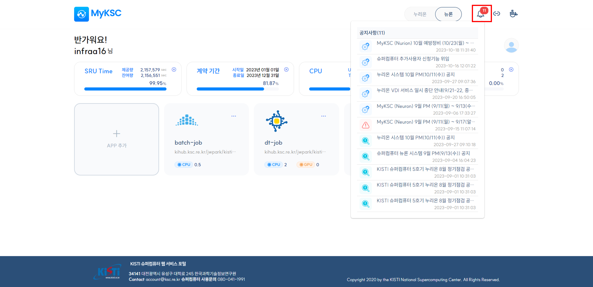
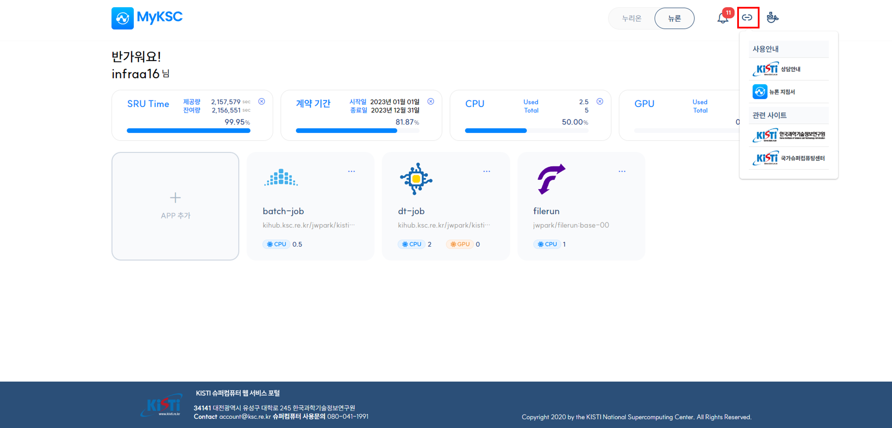
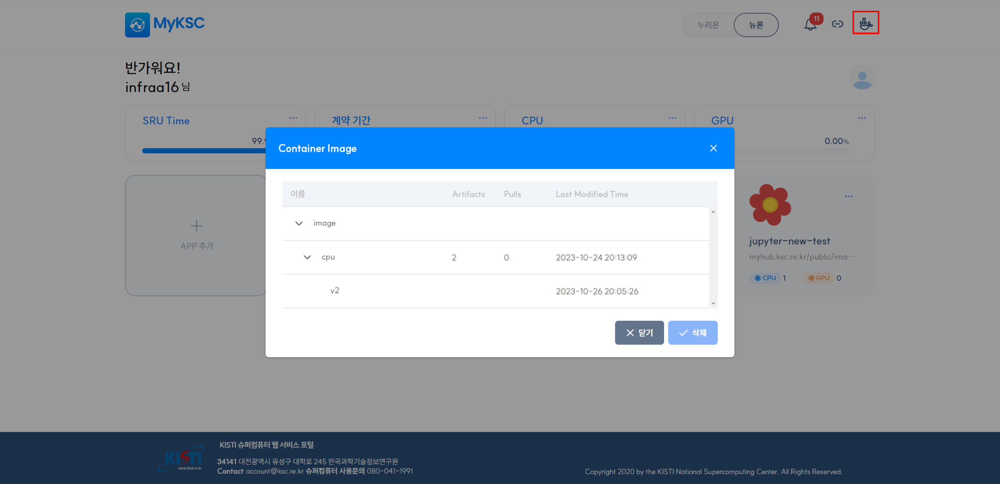
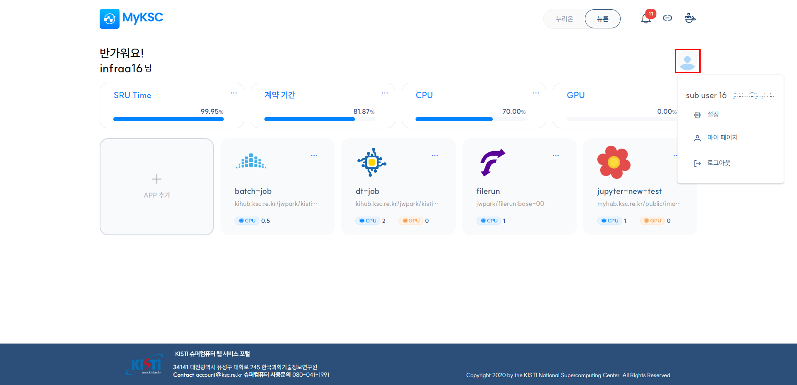
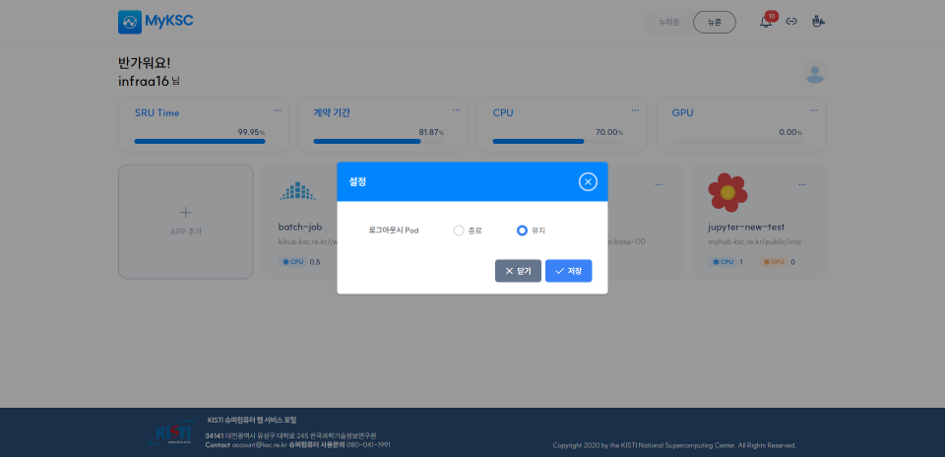

# 주요 메뉴 구성

## 가. 기본 메뉴

#### 1. 공지사항, 사용 안내 및 관련 사이트 목록, Container Image 관리 기능을 제공한다.

#### 2. 확인하지 않은 공지의 수를 표시하며 공지 아이콘을 클릭하면 화면에 공지 목록을 표시한다.

#### 3. 시스템 공지, 장애 공지, 점검 공지를 표시하며 클릭 시 해당 공지가 작성된 사이트로 이동한다.

<figure><figcaption></figcaption></figure>

#### 4. Link 아이콘을 클릭하면 사용 안내에 도움이 되는 사이트 와 관련 사이트 목록을 표시한다.

<figure><figcaption></figcaption></figure>

#### 5. Docker 아이콘을 클릭하면 Container Image 목록을 표시하며 삭제 기능을 제공한다.

<figure><figcaption></figcaption></figure>

## 나.    사용자 메뉴

#### 1. 설정, 마이 페이지, 로그아웃 기능을 제공한다.

<figure><figcaption></figcaption></figure>

#### 2. 설정을 선택하면 로그아웃 시 실행중인 Pod의 종료, 유지 여부를 설정한다.

1\) Default : Pod 유지

2\) 다시 로그인하면 기존 Pod(컨테이너)로 구동중인 서비스를 계속 사용할 수 있음

<figure><figcaption></figcaption></figure>

#### 3. 마이 페이지를 선택하면 국가슈퍼컴퓨팅센터(www.ksc.re.kr)의 마이 페이지 사이트로 이동한다.

#### 4.  로그아웃을 선택하면 로그아웃 처리되어 로그인 화면으로 이동한다.
