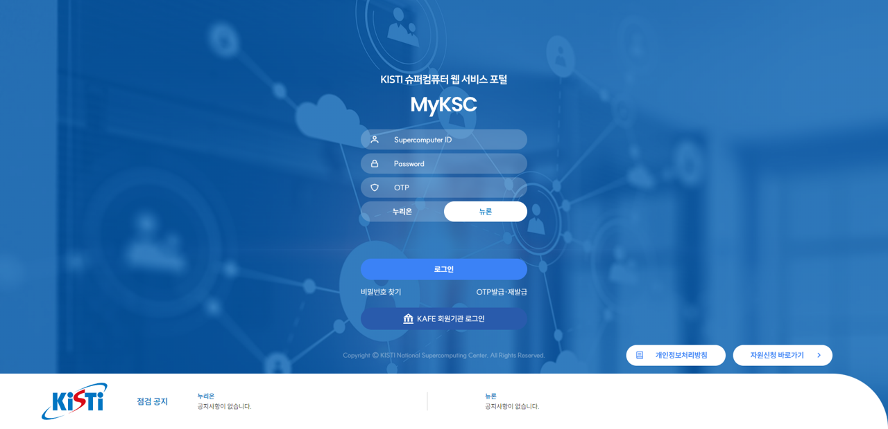
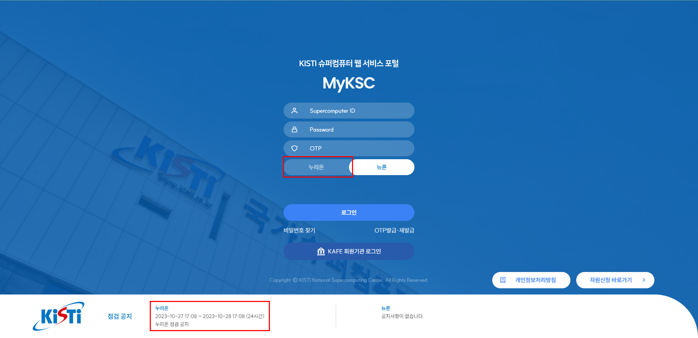
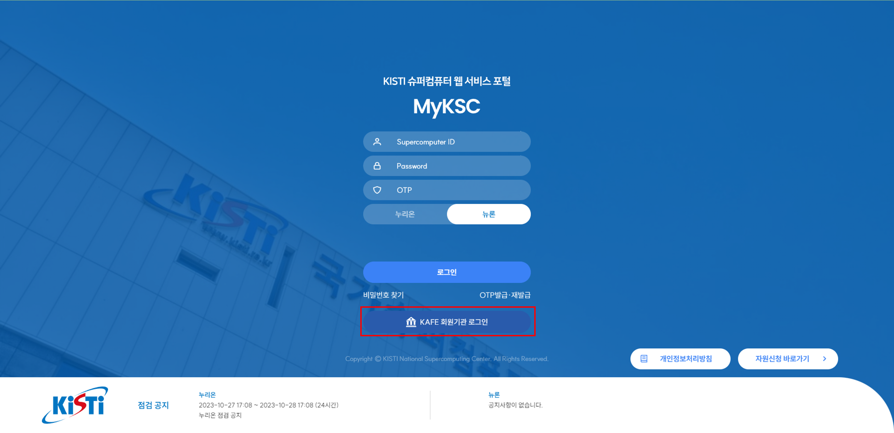
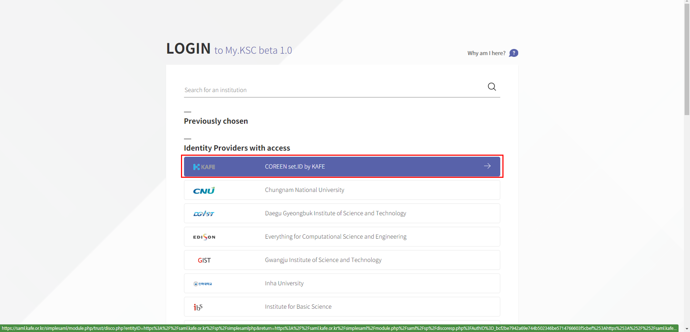
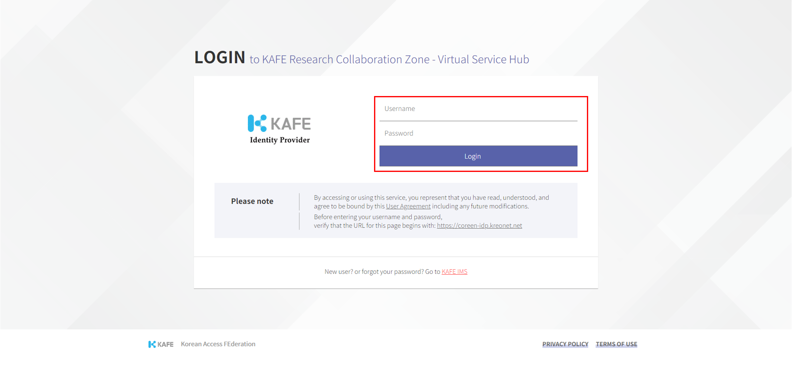
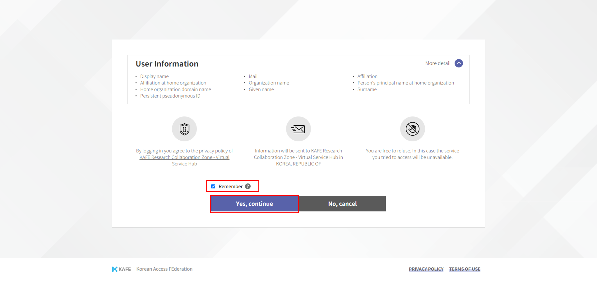
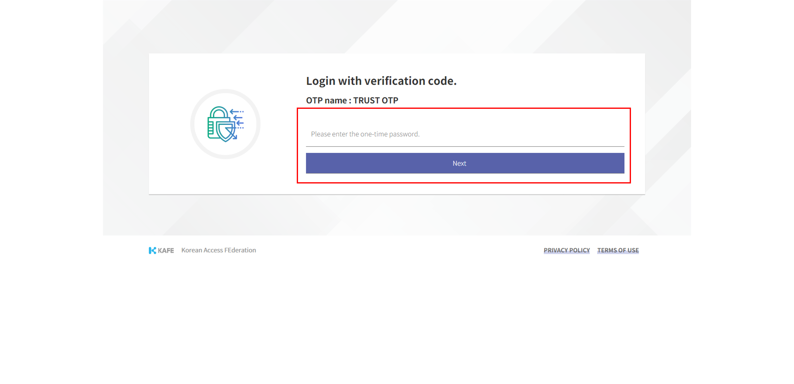

# 로그인

#### 1.사용자 웹 브라우저를 실행하여 [**https://portal.my.ksc.re.kr**](https://portal.my.ksc.re.kr) 에 접속한 후,  슈퍼컴퓨터 사용자 아이디 및 비밀번호, OTP를 입력하고 접속할 시스템 (누리온/뉴론)을 선택 후    로그인 한다.                                                  &#x20;

1\) 현재 MyKSC는 슈퍼컴퓨터 사용자 아이디를 발급 받은 사용자를 위한 서비스이며, 슈퍼컴퓨터 ID 발급 절차는 국가센터 홈페이지(https://www.ksc.re.kr)를 따름

<figure><figcaption></figcaption></figure>

#### 2. 시스템(누리온/뉴론) 점검 중에는 해당 시스템에 로그인이 제한된다.

<figure><figcaption></figcaption></figure>

#### 3.  KAFE 사용자의 경우 KAFE 회원기관 로그인 버튼을 클릭하고, 아래와 같이 인증 절차를 수행한다.

<figure><figcaption></figcaption></figure>

1\) 소속 기관을 선택한다.

<figure><figcaption></figcaption></figure>

2\) 소속 기관에 로그인한다.

<figure><figcaption></figcaption></figure>

3\) Remember 체크 후 Yes, continue 버튼을 클릭한다.

<figure><figcaption></figcaption></figure>

4\) OTP를 입력 후 Next 버튼을 클릭한다.

<figure><figcaption></figcaption></figure>

##
